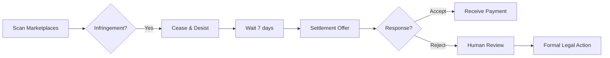
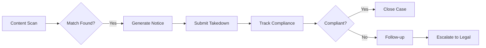
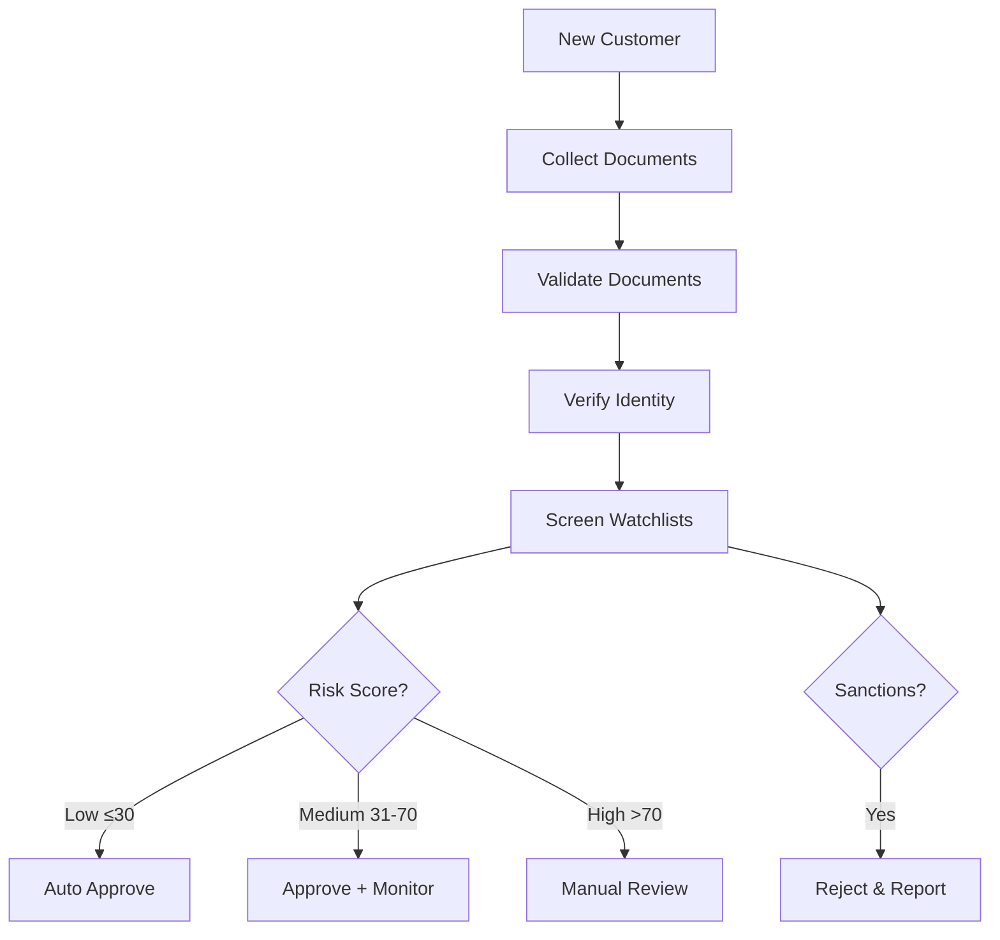
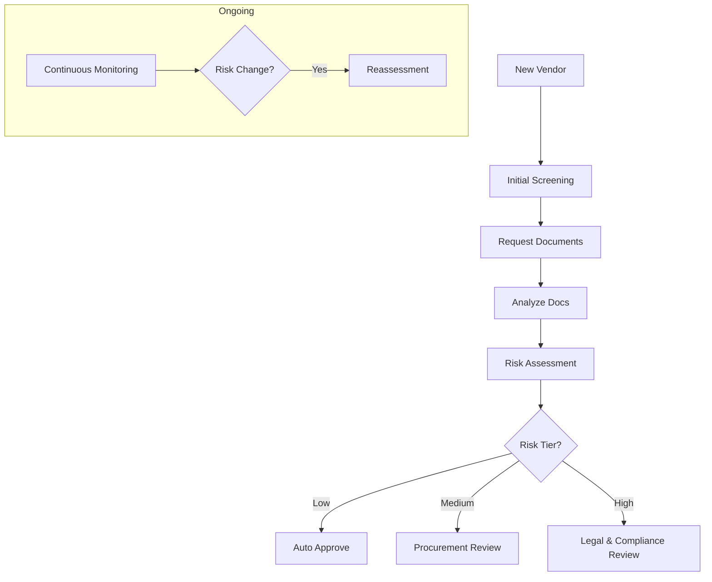
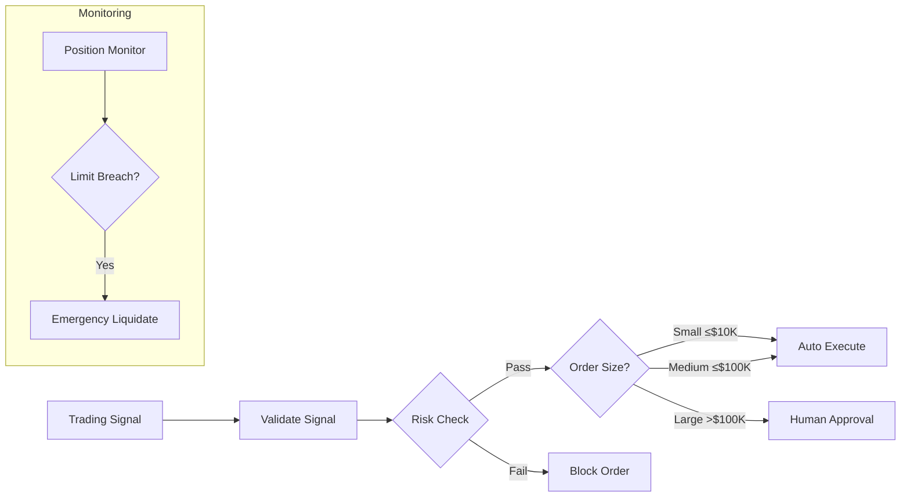
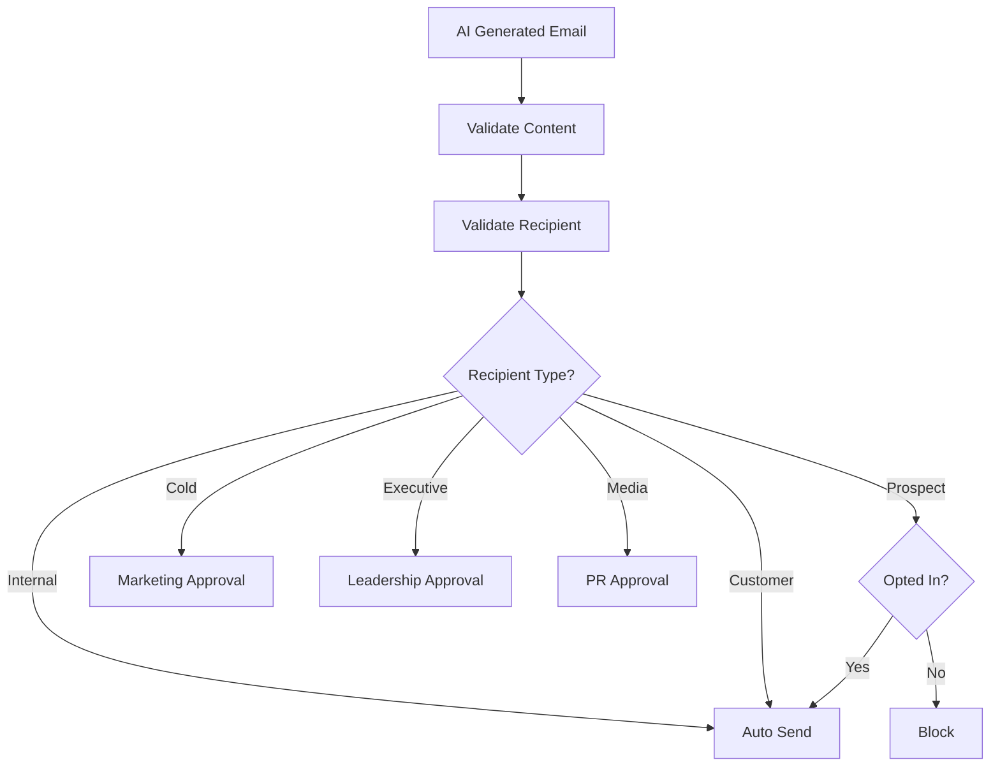

# 47ers Library

The **47ers Library** is a collection of pre-built UAPK manifest templates for common micro-business patterns. Each template is a focused, production-ready configuration that you can customize and deploy.

## What are 47ers?

47ers are small, focused AI agent governance patterns designed to handle specific business workflows. The name comes from the idea of "47 things" an AI agent might need to do - each template covers a cohesive set of related actions with appropriate controls.

## Template Categories

### Legal & IP

IP enforcement, takedown notices, and legal automation

- [IP Enforcement Settlement Gate](#ip-enforcement-settlement-gate)
- [DMCA Takedown Notice Gate](#dmca-takedown-notice-gate)

### Compliance & Risk

KYC, vendor management, and regulatory compliance

- [KYC Onboarding Gate](#kyc-onboarding-gate)
- [Vendor Due Diligence Gate](#vendor-due-diligence-gate)

### Finance & Trading

Trading execution and financial operations

- [Trading Execution Gate](#trading-execution-gate)

### General Purpose

Common business operations and communications

- [Outbound Email Guard](#outbound-email-guard)

---

## Legal & IP Templates

### IP Enforcement Settlement Gate

**ID:** `47er-ip-enforcement-settlement`

Automates IP infringement detection and settlement negotiations with human approval for formal legal actions.



**Capabilities:**

| Action | Auto-Approve | Limit |
|--------|-------------|-------|
| Infringement detection | Yes | 1000/day |
| Cease & desist | Yes | 50/day |
| Settlement offer | Yes (≤$500) | 20/day |
| Formal legal action | **No** | Requires approval |

**Use Cases:**

- Trademark monitoring on marketplaces
- Copyright enforcement
- Automated settlement collection

**Quick Start:**

```bash
# Load the template
python scripts/load_example_manifests.py --template ip-enforcement-settlement

# Customize for your organization
curl -X POST http://localhost:8000/api/v1/orgs/$ORG_ID/manifests \
  -H "Authorization: Bearer $TOKEN" \
  -H "Content-Type: application/json" \
  -d @examples/47ers/legal/ip_enforcement_settlement_gate.json
```

---

### DMCA Takedown Notice Gate

**ID:** `47er-takedown-notice`

Automates DMCA takedown notice generation and submission with compliance tracking.



**Capabilities:**

| Action | Auto-Approve | Limit |
|--------|-------------|-------|
| Content scanning | Yes | 5000/day |
| Generate notice | Yes | 500/day |
| Submit takedown | Yes | 200/day |
| Counter-notice response | **No** | Requires approval |

**Use Cases:**

- YouTube content protection
- Social media takedowns
- Website infringement

---

## Compliance & Risk Templates

### KYC Onboarding Gate

**ID:** `47er-kyc-onboarding`

Automates Know Your Customer verification with risk-based routing and tiered approval.



**Risk Scoring:**

| Factor | Weight |
|--------|--------|
| Jurisdiction | 25% |
| PEP status | 20% |
| Document quality | 15% |
| Watchlist match | 20% |
| Transaction profile | 20% |

**Thresholds:**

- **Auto-approve:** Score ≤ 30
- **Enhanced monitoring:** Score 31-70
- **Manual review:** Score > 70
- **Auto-reject:** Sanctions match

**Prohibited Jurisdictions:** KP, IR, SY, CU

---

### Vendor Due Diligence Gate

**ID:** `47er-vendor-due-diligence`

Automates third-party vendor risk assessment and ongoing monitoring.



**Required Certifications:**

| Vendor Type | Required |
|-------------|----------|
| Critical vendors | SOC2, ISO27001 |
| Data processors | SOC2, GDPR-compliant |
| Financial | PCI-DSS, SOC2 |

**Reassessment Schedule:**

- Critical: Quarterly
- High risk: Semi-annually
- Medium: Annually
- Low: Bi-annually

---

## Finance Templates

### Trading Execution Gate

**ID:** `47er-trading-execution`

Governs algorithmic trading with position limits, risk checks, and circuit breakers.



**Position Limits:**

| Limit | Value |
|-------|-------|
| Max single position | $500,000 |
| Max total exposure | $2,000,000 |
| Max sector concentration | 25% |
| Max single name | 10% |

**Risk Limits:**

| Limit | Value |
|-------|-------|
| Max daily loss | $50,000 |
| Max VaR (95%) | $100,000 |
| Max drawdown | 5% |
| Stop-loss trigger | 2% |

**Circuit Breakers:**

- Halt on loss: $50,000
- Halt on error rate: 5%
- Halt on latency: 1000ms

---

## General Templates

### Outbound Email Guard

**ID:** `47er-outbound-email-guard`

Governs AI-generated outbound emails with content review, rate limiting, and recipient validation.



**Rate Limits:**

| Scope | Limit |
|-------|-------|
| Per recipient/day | 3 |
| Per recipient/week | 5 |
| Per domain/hour | 50 |
| Per domain/day | 200 |
| Total/hour | 500 |
| Total/day | 2,000 |

**Escalation Triggers:**

- Executive recipient
- Media contact
- Regulator contact
- Pricing mentions
- Legal content
- Competitor mentions
- Attachments
- Bulk sends > 50

---

## Using Templates

### Load Templates

```bash
# Load all templates into demo environment
make demo

# Or load specific template
python scripts/load_example_manifests.py --template kyc-onboarding
```

### Customize Templates

Templates use `{{PLACEHOLDER}}` syntax for customization:

```json
{
  "agent": {
    "organization": "{{ORG_SLUG}}",
    "team": "compliance"
  },
  "metadata": {
    "contact": "compliance@{{ORG_DOMAIN}}"
  }
}
```

Set placeholders when loading:

```bash
python scripts/load_example_manifests.py \
  --template kyc-onboarding \
  --var ORG_SLUG=acme-corp \
  --var ORG_DOMAIN=acme.com
```

### Connector Configuration

Templates reference connector configs in `connectors/`:

```json
{
  "connectors": {
    "email": {
      "type": "smtp",
      "config_ref": "connectors/email_smtp.json"
    }
  }
}
```

Configure connectors with your credentials:

```bash
# Set connector secrets
export SMTP_HOST=smtp.sendgrid.net
export SMTP_USERNAME=apikey
export SMTP_PASSWORD=your-api-key
```

### Demo Mode

Templates support mock mode for testing:

```json
{
  "mock_mode": {
    "enabled": "{{DEMO_MODE}}",
    "log_only": true,
    "response": {
      "success": true,
      "message_id": "mock-{{UUID}}"
    }
  }
}
```

Enable demo mode:

```bash
export DEMO_MODE=true
make demo
```

---

## Creating Custom Templates

### Template Structure

```json
{
  "$schema": "https://uapk.dev/schemas/manifest.v1.json",
  "version": "1.0",
  "template": {
    "id": "47er-my-template",
    "name": "My Template Name",
    "category": "general",
    "description": "What this template does"
  },
  "agent": { ... },
  "roles": [ ... ],
  "capabilities": { ... },
  "action_types": { ... },
  "constraints": { ... },
  "connectors": { ... },
  "workflows": { ... },
  "metadata": { ... }
}
```

### Best Practices

1. **Least Privilege**: Request only needed capabilities
2. **Tiered Approval**: Use auto-approve for low-risk, escalate for high-risk
3. **Rate Limiting**: Set appropriate limits for each action type
4. **Clear Escalation**: Define when and why to escalate
5. **Audit Trail**: Log all actions for compliance

---

## Related

- [UAPK Manifest](concepts/manifest) - Manifest schema
- [Policy Decisions](concepts/decisions) - How decisions work
- [Demo Walkthrough](demo) - Hands-on tutorial
- [API: Manifests](api/manifests) - Manifest API
