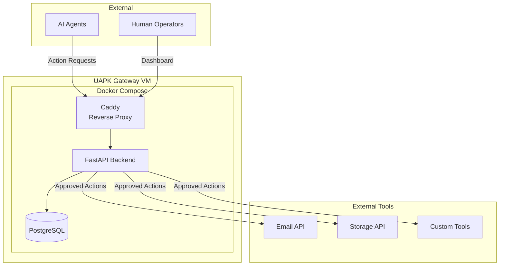
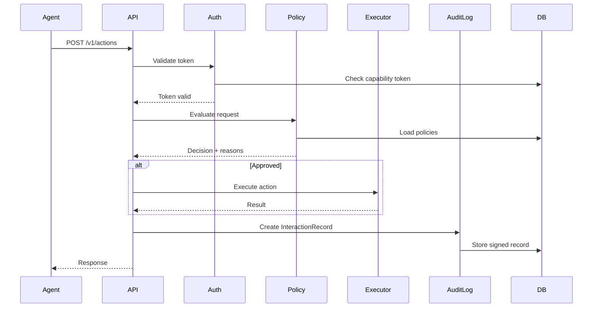

# Architecture Overview

UAPK Gateway is designed as a single-VM deployment using Docker Compose.

## System Architecture



## Component Overview

### Backend (FastAPI)

The core application handling:

- **API Layer**: RESTful endpoints for agents and operators
- **Policy Engine**: Evaluates action requests against policies
- **Audit Logger**: Creates tamper-evident InteractionRecords
- **Operator UI**: Server-rendered dashboard with HTMX

### Database (PostgreSQL)

Stores:

- Organizations and teams
- Agent registrations and manifests
- Policies and capability tokens
- InteractionRecords (audit log)

### Reverse Proxy (Caddy)

Production deployment includes Caddy for:

- Automatic TLS certificates
- Request routing
- Security headers
- Rate limiting

## Request Flow



## Directory Structure

```
uapk-gateway/
├── backend/           # FastAPI application
│   ├── app/
│   │   ├── api/       # API routes
│   │   ├── core/      # Configuration, logging
│   │   ├── models/    # SQLAlchemy models
│   │   ├── schemas/   # Pydantic schemas
│   │   ├── services/  # Business logic
│   │   └── ui/        # Operator dashboard
│   └── tests/
├── deploy/            # Deployment configs
│   ├── caddy/
│   ├── postgres/
│   └── systemd/
├── docs/              # MkDocs documentation
├── schemas/           # JSON schemas
├── examples/          # Example manifests
└── scripts/           # Helper scripts
```

## Design Principles

1. **Single VM**: Everything runs on one machine via Docker Compose
2. **Boring Tech**: PostgreSQL, FastAPI, standard libraries
3. **Typed Everything**: Python type hints, Pydantic validation
4. **Audit First**: Every action creates a signed log entry
5. **Operator Control**: Humans can always intervene
