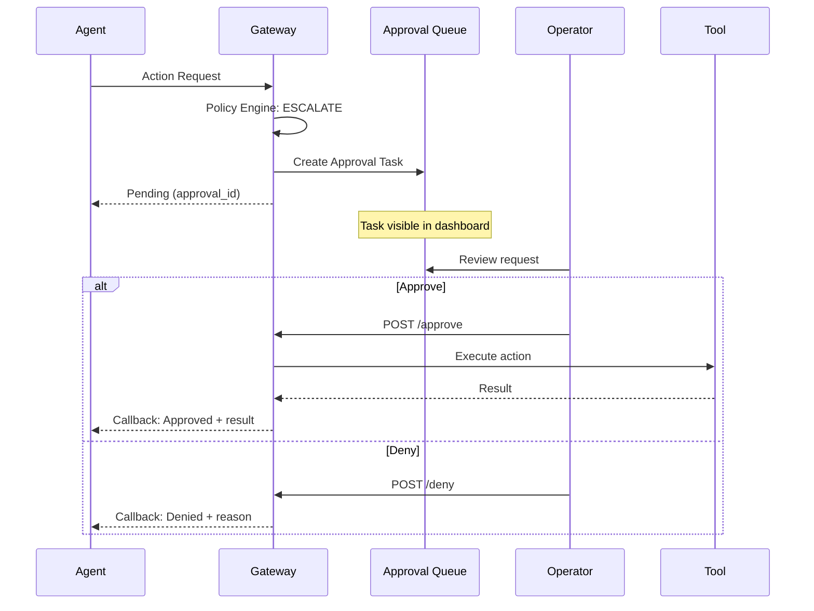
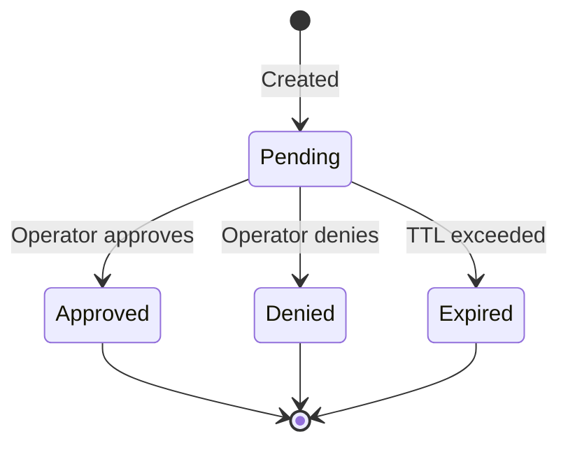

import Tabs from '@theme/Tabs';
import TabItem from '@theme/TabItem';

# Approval Workflow

When the policy engine returns **ESCALATE**, an approval task is created for human review. Operators can approve or deny the action via the dashboard or API.

## Workflow Overview



## Approval States



| Status | Description |
|--------|-------------|
| `pending` | Awaiting operator review |
| `approved` | Operator approved, action executed |
| `denied` | Operator denied |
| `expired` | No decision before expiry (default: 24h) |

## Creating Approvals

Approvals are created automatically when policy returns ESCALATE:

```json
{
  "interaction_id": "int-abc123",
  "decision": "ESCALATE",
  "reasons": [
    {
      "code": "REQUIRES_APPROVAL",
      "message": "Action 'kubernetes:deploy' requires human approval"
    }
  ],
  "approval_id": "appr-xyz789",
  "executed": false,
  "timestamp": "2024-12-14T10:00:00Z"
}
```

The agent should store the `approval_id` to poll for status or receive callbacks.

## Viewing Approvals

### Dashboard

Navigate to **Approvals** in the sidebar to see pending tasks:

- Filter by status (pending, approved, denied, expired)
- Click a task to see full details
- Approve or deny with optional notes

### API

```bash
# List pending approvals
curl http://localhost:8000/api/v1/orgs/$ORG_ID/approvals?status=pending \
  -H "Authorization: Bearer $TOKEN"
```

Response:

```json
{
  "items": [
    {
      "approval_id": "appr-xyz789",
      "uapk_id": "deployment-bot",
      "agent_id": "deployment-bot",
      "action": {
        "type": "kubernetes",
        "tool": "deploy",
        "params": {
          "namespace": "production",
          "image": "app:v2.0.0"
        }
      },
      "reason_codes": ["REQUIRES_APPROVAL"],
      "status": "pending",
      "created_at": "2024-12-14T10:00:00Z",
      "expires_at": "2024-12-15T10:00:00Z"
    }
  ],
  "total": 1
}
```

## Approving Requests

<Tabs>
<TabItem value="dashboard" label="Dashboard">

1. Navigate to **Approvals**
2. Click the pending approval
3. Review the action details
4. Click **Approve** (optionally add notes)

</TabItem>
<TabItem value="api" label="API">

```bash
curl -X POST http://localhost:8000/api/v1/orgs/$ORG_ID/approvals/appr-xyz789/approve \
  -H "Authorization: Bearer $TOKEN" \
  -H "Content-Type: application/json" \
  -d '{
    "notes": "Reviewed deployment plan, approved for production"
  }'
```

</TabItem>
</Tabs>

Response after approval:

```json
{
  "approval_id": "appr-xyz789",
  "status": "approved",
  "approved_by": "admin@example.com",
  "approved_at": "2024-12-14T10:15:00Z",
  "notes": "Reviewed deployment plan, approved for production",
  "execution_result": {
    "success": true,
    "data": {"deployment_id": "deploy-abc"}
  }
}
```

## Denying Requests

<Tabs>
<TabItem value="dashboard" label="Dashboard">

1. Navigate to **Approvals**
2. Click the pending approval
3. Review the action details
4. Click **Deny** and provide a reason

</TabItem>
<TabItem value="api" label="API">

```bash
curl -X POST http://localhost:8000/api/v1/orgs/$ORG_ID/approvals/appr-xyz789/deny \
  -H "Authorization: Bearer $TOKEN" \
  -H "Content-Type: application/json" \
  -d '{
    "reason": "Not approved for production deployment during freeze",
    "notes": "Code freeze in effect until Dec 20"
  }'
```

</TabItem>
</Tabs>

Response:

```json
{
  "approval_id": "appr-xyz789",
  "status": "denied",
  "denied_by": "admin@example.com",
  "denied_at": "2024-12-14T10:15:00Z",
  "reason": "Not approved for production deployment during freeze",
  "notes": "Code freeze in effect until Dec 20"
}
```

## Polling for Status

Agents can poll for approval status:

```bash
curl http://localhost:8000/api/v1/orgs/$ORG_ID/approvals/appr-xyz789 \
  -H "Authorization: Bearer $TOKEN"
```

## Expiry

Approvals expire after a configurable period (default: 24 hours). Expired approvals:

- Are marked as `expired` status
- Do not execute the action
- Are logged in the audit trail

Configure expiry in environment:

```bash
GATEWAY_APPROVAL_EXPIRY_HOURS=24
```

## Notifications

:::info[Coming Soon]
Webhook notifications for approval events are planned for v0.2.
:::

## Audit Trail

All approval actions are logged:

```json
{
  "record_id": "int-abc123",
  "decision": "pending",
  "approval_id": "appr-xyz789",
  "approval_status": "approved",
  "approved_by": "admin@example.com",
  "approved_at": "2024-12-14T10:15:00Z"
}
```

## Best Practices

:::tip[Review Before Production]
Always require approval for production deployments.
:::

:::tip[Set Reasonable Expiry]
Balance responsiveness with security. 24 hours is typical.
:::

:::tip[Add Context in Notes]
Document why you approved or denied for audit purposes.
:::

:::warning[Don't Auto-Approve]
Never create automation that auto-approves escalated requests.
:::

## Related

- [Policy Decisions](decisions.md) - What triggers ESCALATE
- [Operator Guide](../operator/approvals.md) - Managing approvals
- [API: Approvals](../api/approvals.md) - Complete API reference
