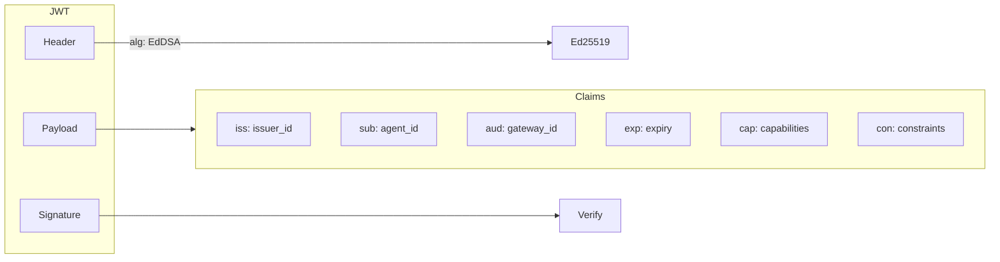
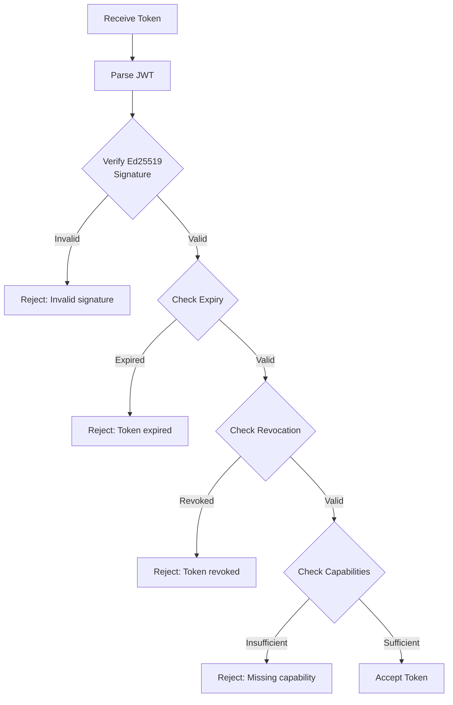
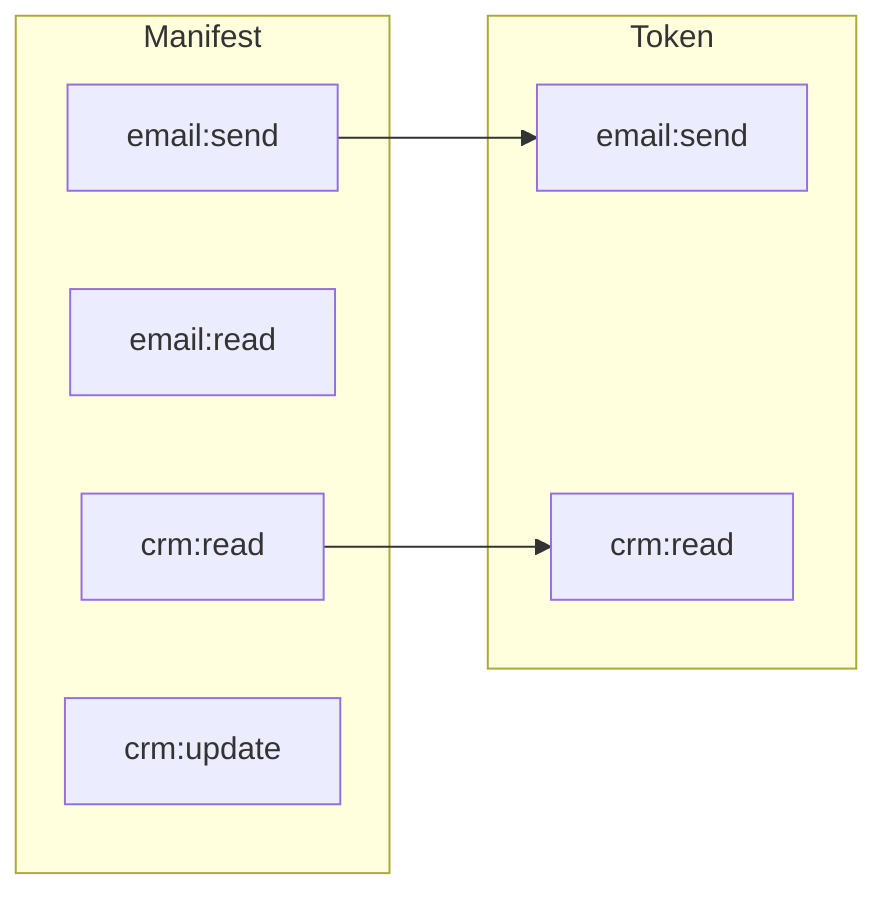

# Capability Tokens

**Capability Tokens** are Ed25519-signed JWTs that grant specific, time-limited permissions to agents. They provide fine-grained access control beyond what's declared in the manifest.

## Purpose

Capability tokens enable:

1. **Time-Limited Access**: Tokens expire automatically
2. **Scope Limiting**: Grant subset of manifest capabilities
3. **Revocation**: Invalidate tokens before expiry
4. **Audit Trail**: Track which token was used for each action
5. **Delegation**: Third parties can issue tokens with constraints

## Token Structure



### Example Token Payload

```json
{
  "iss": "issuer-abc123",
  "sub": "customer-support-bot",
  "aud": "uapk-gateway",
  "iat": 1702560000,
  "exp": 1702646400,
  "jti": "tok-xyz789",
  "cap": ["email:send", "crm:read"],
  "con": {
    "max_actions": 100,
    "allowed_recipients": ["*@acme.com"]
  }
}
```

## Token Claims

| Claim | Type | Description |
|-------|------|-------------|
| `iss` | string | Issuer ID (capability issuer) |
| `sub` | string | Subject (agent ID) |
| `aud` | string | Audience (gateway identifier) |
| `iat` | integer | Issued at (Unix timestamp) |
| `exp` | integer | Expiry (Unix timestamp) |
| `jti` | string | Token ID (for revocation) |
| `cap` | array | Granted capabilities |
| `con` | object | Additional constraints |

## Issuing Tokens

### 1. Register a Capability Issuer

First, register a capability issuer to get signing keys:

```bash
curl -X POST http://localhost:8000/api/v1/orgs/$ORG_ID/capability-issuers \
  -H "Authorization: Bearer $TOKEN" \
  -H "Content-Type: application/json" \
  -d '{
    "name": "main-issuer",
    "description": "Primary token issuer for production"
  }'
```

Response includes the public key:

```json
{
  "issuer_id": "issuer-abc123",
  "name": "main-issuer",
  "public_key": "MCowBQYDK2VwAyEA...",
  "created_at": "2024-12-14T10:00:00Z"
}
```

### 2. Issue a Token

```bash
curl -X POST http://localhost:8000/api/v1/orgs/$ORG_ID/capability-tokens \
  -H "Authorization: Bearer $TOKEN" \
  -H "Content-Type: application/json" \
  -d '{
    "issuer_id": "issuer-abc123",
    "agent_id": "customer-support-bot",
    "manifest_id": "manifest-uuid",
    "capabilities": ["email:send", "crm:read"],
    "expires_in_hours": 24,
    "constraints": {
      "max_actions": 100
    }
  }'
```

Response:

```json
{
  "token_id": "tok-xyz789",
  "token": "eyJhbGciOiJFZERTQSIsInR5cCI6IkpXVCJ9...",
  "expires_at": "2024-12-15T10:00:00Z",
  "capabilities": ["email:send", "crm:read"]
}
```

### 3. Use the Token

Include the token in gateway requests:

```bash
curl -X POST http://localhost:8000/api/v1/gateway/execute \
  -H "X-API-Key: YOUR_API_KEY" \
  -H "Content-Type: application/json" \
  -d '{
    "uapk_id": "customer-support-bot",
    "agent_id": "customer-support-bot",
    "capability_token": "eyJhbGciOiJFZERTQSIsInR5cCI6IkpXVCJ9...",
    "action": {
      "type": "email",
      "tool": "send",
      "params": {...}
    }
  }'
```

## Token Validation

The gateway validates tokens by checking:



## Revocation

Revoke a token before expiry:

```bash
curl -X POST http://localhost:8000/api/v1/orgs/$ORG_ID/capability-tokens/tok-xyz789/revoke \
  -H "Authorization: Bearer $TOKEN" \
  -H "Content-Type: application/json" \
  -d '{
    "reason": "Suspected compromise"
  }'
```

## Capability Scoping

Tokens can only grant capabilities that are:

1. Declared in the agent's manifest
2. Approved for the manifest



:::warning[Cannot Exceed Manifest]
A token cannot grant capabilities not declared in the manifest.
:::

## Constraints

Tokens can include additional constraints beyond the manifest:

| Constraint | Type | Description |
|------------|------|-------------|
| `max_actions` | integer | Maximum actions with this token |
| `allowed_recipients` | array | Email recipient restrictions |
| `ip_whitelist` | array | Allowed IP addresses |
| `custom` | object | Custom constraints for tools |

```json
{
  "constraints": {
    "max_actions": 50,
    "allowed_recipients": ["*@acme.com", "partner@example.com"],
    "ip_whitelist": ["10.0.0.0/8"],
    "custom": {
      "max_email_size_kb": 1024
    }
  }
}
```

## Best Practices

:::tip[Short Expiry]
Issue tokens with the shortest practical expiry. 24 hours is a good default.
:::

:::tip[Minimal Scope]
Grant only the capabilities needed for the specific task.
:::

:::tip[One Token Per Task]
Issue new tokens for distinct workflows rather than reusing tokens.
:::

:::warning[Token Storage]
Agents should store tokens securely and never log the full token value.
:::

## Related

- [UAPK Manifest](manifest) - Declaring agent capabilities
- [Policy Decisions](decisions) - How tokens affect decisions
- [API: Capability Tokens](../api/gateway) - Complete API reference
