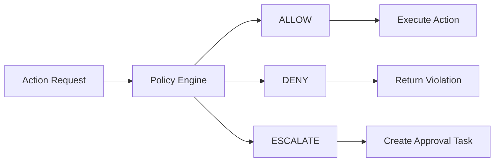
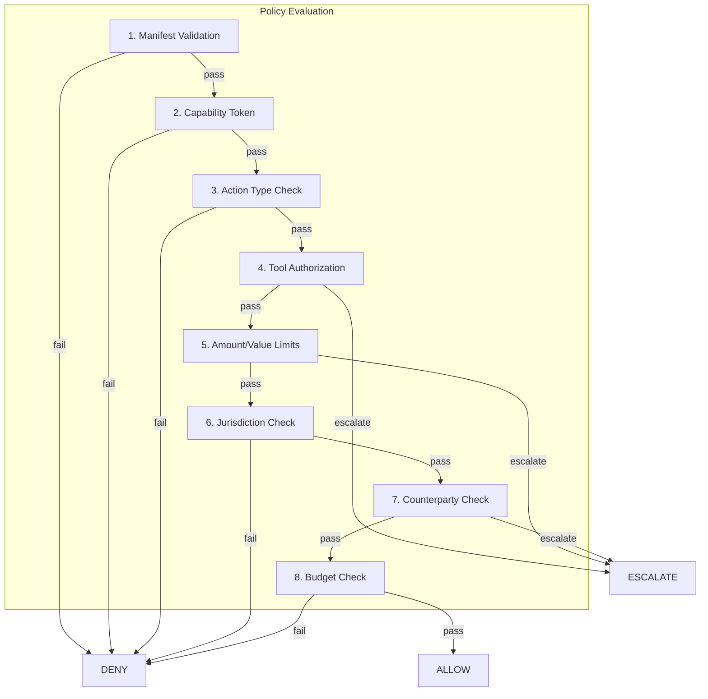

# Policy Decisions

The **Policy Engine** evaluates every action request and returns one of three decisions: **ALLOW**, **DENY**, or **ESCALATE**.

## Decision Types



| Decision | Meaning | Result |
|----------|---------|--------|
| **ALLOW** | Request passes all checks | Action is executed |
| **DENY** | Request violates policy | Action is blocked |
| **ESCALATE** | Request requires human review | Approval task is created |

## Evaluation Order

The policy engine evaluates requests through a series of checks:



### Check Details

| Check | Description | Possible Outcomes |
|-------|-------------|-------------------|
| **Manifest Validation** | Is there a valid, active manifest? | Pass / Deny |
| **Capability Token** | Is the token valid and not expired? | Pass / Deny |
| **Action Type** | Is this action type allowed? | Pass / Deny |
| **Tool Authorization** | Is the specific tool authorized? | Pass / Deny / Escalate |
| **Amount Limits** | Does the value exceed thresholds? | Pass / Escalate |
| **Jurisdiction** | Is the counterparty in an allowed region? | Pass / Deny |
| **Counterparty** | Is the counterparty on a blocklist? | Pass / Deny / Escalate |
| **Budget** | Has the budget been exceeded? | Pass / Deny |

## Policy Trace

Every decision includes a **policy trace** showing which checks ran and their results:

```json
{
  "decision": "DENY",
  "reasons": [
    {
      "code": "BUDGET_EXCEEDED",
      "message": "Daily action limit exceeded",
      "details": {
        "current": 501,
        "limit": 500
      }
    }
  ],
  "policy_trace": {
    "checks": [
      {"check": "manifest_validation", "result": "pass"},
      {"check": "capability_token", "result": "pass"},
      {"check": "action_type", "result": "pass"},
      {"check": "tool_authorization", "result": "pass"},
      {"check": "budget_check", "result": "fail", "details": {"current": 501, "limit": 500}}
    ]
  }
}
```

## Reason Codes

When a request is denied or escalated, the response includes reason codes:

### DENY Reasons

| Code | Description |
|------|-------------|
| `MANIFEST_NOT_FOUND` | No manifest registered for this agent |
| `MANIFEST_INACTIVE` | Manifest is suspended or revoked |
| `INVALID_TOKEN` | Capability token is invalid |
| `TOKEN_EXPIRED` | Capability token has expired |
| `TOKEN_REVOKED` | Capability token was revoked |
| `ACTION_NOT_ALLOWED` | Action type is not permitted |
| `TOOL_NOT_AUTHORIZED` | Tool is not in manifest |
| `CAPABILITY_MISSING` | Required capability not in token |
| `BUDGET_EXCEEDED` | Rate limit or budget exceeded |
| `JURISDICTION_BLOCKED` | Counterparty in blocked region |
| `COUNTERPARTY_BLOCKED` | Counterparty on blocklist |

### ESCALATE Reasons

| Code | Description |
|------|-------------|
| `REQUIRES_APPROVAL` | Action requires human approval |
| `AMOUNT_THRESHOLD` | Value exceeds auto-approve threshold |
| `NEW_COUNTERPARTY` | First interaction with counterparty |
| `HIGH_RISK_ACTION` | Action flagged as high risk |

## Example Responses

### ALLOW

```json
{
  "interaction_id": "int-abc123",
  "decision": "ALLOW",
  "reasons": [],
  "executed": true,
  "result": {
    "success": true,
    "data": {"message_id": "msg-789"}
  },
  "timestamp": "2024-12-14T10:30:00Z"
}
```

### DENY

```json
{
  "interaction_id": "int-def456",
  "decision": "DENY",
  "reasons": [
    {
      "code": "BUDGET_EXCEEDED",
      "message": "Hourly action limit exceeded (100/100)"
    }
  ],
  "executed": false,
  "timestamp": "2024-12-14T10:31:00Z"
}
```

### ESCALATE

```json
{
  "interaction_id": "int-ghi789",
  "decision": "ESCALATE",
  "reasons": [
    {
      "code": "REQUIRES_APPROVAL",
      "message": "Action 'kubernetes:deploy' requires human approval"
    }
  ],
  "approval_id": "appr-xyz789",
  "executed": false,
  "timestamp": "2024-12-14T10:32:00Z"
}
```

## Configuring Policies

Policies are configured per organization. See [API: Policies](../api/gateway) for configuration options.

### Example: Require Approval for Deployments

```json
{
  "name": "require-deploy-approval",
  "policy_type": "require_approval",
  "scope": "action",
  "rules": {
    "actions": ["kubernetes:deploy", "github:merge"]
  },
  "enabled": true
}
```

### Example: Block After Hours

```json
{
  "name": "business-hours-only",
  "policy_type": "deny",
  "scope": "global",
  "rules": {
    "time_window": {
      "deny_outside": {
        "start": "08:00",
        "end": "18:00",
        "timezone": "America/New_York",
        "days": ["mon", "tue", "wed", "thu", "fri"]
      }
    }
  },
  "enabled": true
}
```

## Risk Snapshot

Each decision includes a **risk snapshot** capturing metrics at evaluation time:

```json
{
  "risk_snapshot": {
    "budget_current": 45,
    "budget_limit": 100,
    "budget_percent": 45.0,
    "request_amount": null,
    "max_amount": 1000.0
  }
}
```

This helps with audit and debugging.

## Related

- [Approval Workflow](approvals) - What happens after ESCALATE
- [Audit Logs](logs) - How decisions are logged
- [API: Gateway](../api/gateway) - API reference
