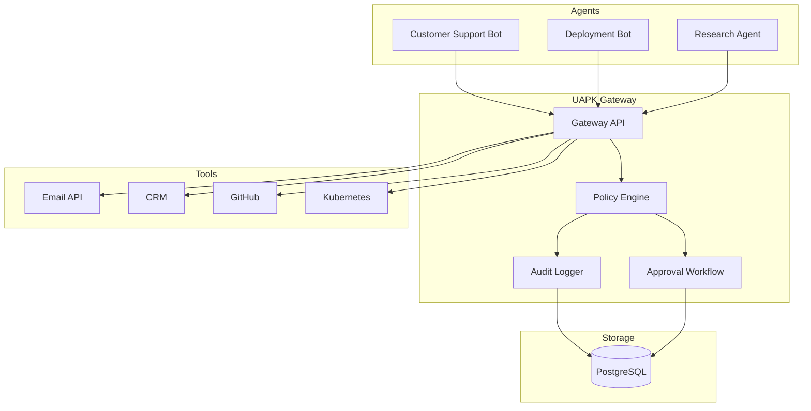
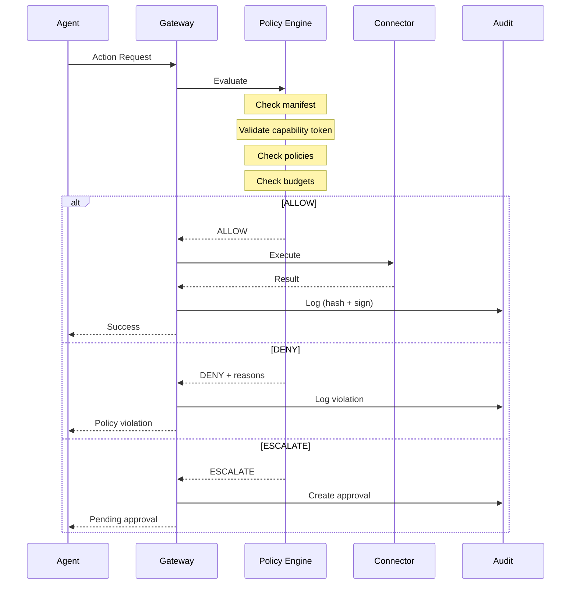
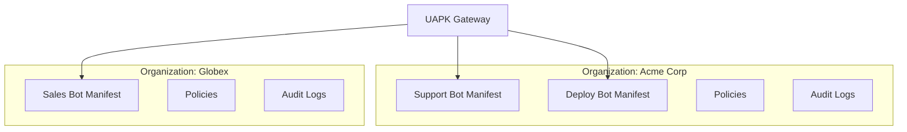

# Core Concepts

UAPK Gateway provides a policy enforcement layer between AI agents and the tools they use. This section explains the core concepts.

## Architecture Overview

## Request Flow

Every agent action request flows through the gateway:

## Key Concepts

| Concept | Description | Learn More |
|---------|-------------|------------|
| **UAPK Manifest** | JSON document declaring agent identity, capabilities, and constraints | [Manifest](manifest) |
| **Capability Token** | Ed25519-signed JWT granting specific permissions | [Capabilities](capabilities) |
| **Policy Decision** | ALLOW, DENY, or ESCALATE based on evaluation | [Decisions](decisions) |
| **Approval Workflow** | Human review for escalated actions | [Approvals](approvals) |
| **Audit Log** | Hash-chained, signed InteractionRecords | [Logs](logs) |

## Multi-Tenancy

UAPK Gateway supports multiple organizations with isolated data:

Each organization has:

- Independent manifests and agents
- Separate policies and approval workflows
- Isolated audit logs
- Distinct API keys and users

## Security Model

UAPK Gateway implements defense-in-depth:

1. **Authentication**: JWT tokens for users, API keys for agents
2. **Authorization**: RBAC for operators, capability tokens for agents
3. **Policy Enforcement**: Rules evaluated at runtime
4. **Audit Trail**: Tamper-evident, cryptographically signed logs
5. **Key Management**: Ed25519 keys for signing tokens and records

See [Security](../security) for the full threat model.

## Next Steps

### [UAPK Manifest](manifest)
Learn how to declare agent identity and capabilities.

### [Capability Tokens](capabilities)
Understand fine-grained, time-limited permissions.

### [Policy Decisions](decisions)
How the policy engine evaluates requests.

### [Approvals](approvals)
Configure human-in-the-loop workflows.
