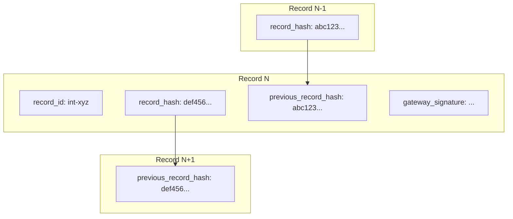
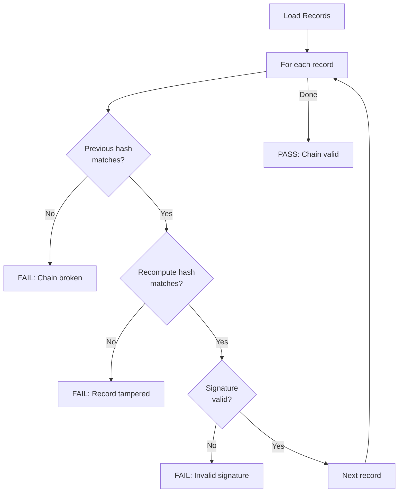

# Audit Logs

Every action request creates an **InteractionRecord**—a tamper-evident audit log entry that is hash-chained and cryptographically signed.

## Why Tamper-Evident Logs?

Traditional logs can be modified or deleted without detection. UAPK Gateway's audit logs provide:

1. **Hash Chaining**: Each record includes the hash of the previous record
2. **Cryptographic Signatures**: Ed25519 signatures prove authenticity
3. **Immutable History**: Any modification breaks the chain
4. **Offline Verification**: Logs can be verified without the gateway

## Record Structure



### Fields

| Field | Type | Description |
|-------|------|-------------|
| `record_id` | string | Unique identifier (e.g., `int-abc123`) |
| `org_id` | UUID | Organization |
| `uapk_id` | string | Agent manifest ID |
| `agent_id` | string | Agent identifier |
| `action_type` | string | Action category (e.g., `email`) |
| `tool` | string | Specific tool (e.g., `send`) |
| `request` | object | Original request parameters |
| `request_hash` | string | SHA-256 of canonical request |
| `decision` | enum | `approved`, `denied`, `pending` |
| `reasons_json` | string | Canonical JSON of decision reasons |
| `policy_trace_json` | string | Canonical JSON of policy checks |
| `result` | object | Execution result (if allowed) |
| `result_hash` | string | SHA-256 of canonical result |
| `previous_record_hash` | string | Hash of previous record in chain |
| `record_hash` | string | SHA-256 of this record |
| `gateway_signature` | string | Ed25519 signature (Base64) |
| `created_at` | datetime | Timestamp |

## Hash Computation

The record hash is computed from canonical data:

```python
record_data = {
    "record_id": "int-abc123",
    "org_id": "org-uuid",
    "uapk_id": "my-agent",
    "agent_id": "my-agent",
    "action_type": "email",
    "tool": "send",
    "request_hash": "sha256...",
    "decision": "approved",
    "reasons_json": "[]",
    "policy_trace_json": "{...}",
    "result_hash": "sha256...",
    "previous_record_hash": "previous-sha256...",
    "created_at": "2024-12-14T10:00:00+00:00"
}

canonical = canonicalize_json(record_data)
record_hash = sha256(canonical)
```

### Canonical JSON

Deterministic serialization ensures consistent hashing:

- Keys sorted alphabetically
- No whitespace
- Floats normalized
- Timestamps in ISO 8601

## Chain Verification

To verify a chain:



### Using the CLI

```bash
# Export logs
curl -X POST http://localhost:8000/api/v1/orgs/$ORG_ID/logs/export/download \
  -H "Authorization: Bearer $TOKEN" \
  -H "Content-Type: application/json" \
  -d '{"uapk_id": "my-agent"}' \
  > export.json

# Verify offline
python scripts/verify_log_chain.py export.json
```

Output:

```
Verifying chain of 42 records...
  [1/42] Verifying int-001... OK
  [2/42] Verifying int-002... OK
  ...

Chain verification PASSED
  Records verified: 42
  First record: int-001
  Last record: int-042
  First hash: a1b2c3...
  Last hash: x7y8z9...
```

### Using the API

```bash
curl http://localhost:8000/api/v1/orgs/$ORG_ID/logs/verify/my-agent \
  -H "Authorization: Bearer $TOKEN"
```

Response:

```json
{
  "is_valid": true,
  "record_count": 42,
  "first_record_id": "int-001",
  "last_record_id": "int-042",
  "first_record_hash": "a1b2c3...",
  "last_record_hash": "x7y8z9...",
  "errors": [],
  "verified_at": "2024-12-14T12:00:00Z"
}
```

## Querying Logs

### List Records

```bash
curl "http://localhost:8000/api/v1/orgs/$ORG_ID/logs?uapk_id=my-agent&limit=50" \
  -H "Authorization: Bearer $TOKEN"
```

### Filter Options

| Parameter | Type | Description |
|-----------|------|-------------|
| `uapk_id` | string | Filter by agent |
| `agent_id` | string | Filter by agent ID |
| `action_type` | string | Filter by action type |
| `tool` | string | Filter by tool |
| `decision` | enum | `approved`, `denied`, `pending` |
| `from` | datetime | Start of time range |
| `to` | datetime | End of time range |
| `limit` | integer | Max results (default 50) |
| `offset` | integer | Pagination offset |

### Get Single Record

```bash
curl http://localhost:8000/api/v1/orgs/$ORG_ID/logs/int-abc123 \
  -H "Authorization: Bearer $TOKEN"
```

## Exporting Logs

### JSON Bundle

```bash
curl -X POST http://localhost:8000/api/v1/orgs/$ORG_ID/logs/export/download \
  -H "Authorization: Bearer $TOKEN" \
  -H "Content-Type: application/json" \
  -d '{
    "uapk_id": "my-agent",
    "from": "2024-12-01T00:00:00Z",
    "to": "2024-12-14T23:59:59Z",
    "include_manifest": true
  }'
```

Bundle includes:

- Metadata (export ID, timestamps)
- Manifest snapshot
- Chain verification result
- All records in chronological order

### JSONL Format

```bash
curl -X POST http://localhost:8000/api/v1/orgs/$ORG_ID/logs/export/jsonl \
  -H "Authorization: Bearer $TOKEN" \
  -H "Content-Type: application/json" \
  -d '{"uapk_id": "my-agent"}' \
  > logs.jsonl
```

Each line is a JSON object:

```
{"type":"metadata","export_id":"...","record_count":42}
{"type":"manifest","uapk_id":"my-agent","version":"1.0.0"}
{"type":"record","record_id":"int-001",...}
{"type":"record","record_id":"int-002",...}
```

## Policy Trace

Each record includes a structured trace of policy checks:

```json
{
  "policy_trace_json": {
    "checks": [
      {"check": "manifest_validation", "result": "pass"},
      {"check": "capability_token", "result": "pass"},
      {"check": "action_type", "result": "pass"},
      {"check": "tool_authorization", "result": "pass"},
      {"check": "budget_check", "result": "pass", "details": {"current": 45, "limit": 100}}
    ]
  }
}
```

## Risk Snapshot

Point-in-time risk metrics:

```json
{
  "risk_snapshot_json": {
    "budget_current": 45,
    "budget_limit": 100,
    "budget_percent": 45.0,
    "request_amount": null,
    "max_amount": 1000.0
  }
}
```

## Retention

:::info[Retention Policy]
Configure log retention based on compliance requirements. Default is indefinite.
:::

## Best Practices

:::tip[Regular Verification]
Run chain verification daily as part of compliance checks.
:::

:::tip[Export and Archive]
Export logs regularly to cold storage with verification reports.
:::

:::tip[Secure Gateway Keys]
The Ed25519 signing key must be protected. See [Key Management](../security/key-management).
:::

## Related

- [Operator: Audit](../operator/audit) - Audit procedures
- [Security: Data Handling](../security/data-handling) - Data protection
- [API: Logs](../api/logs) - Complete API reference
