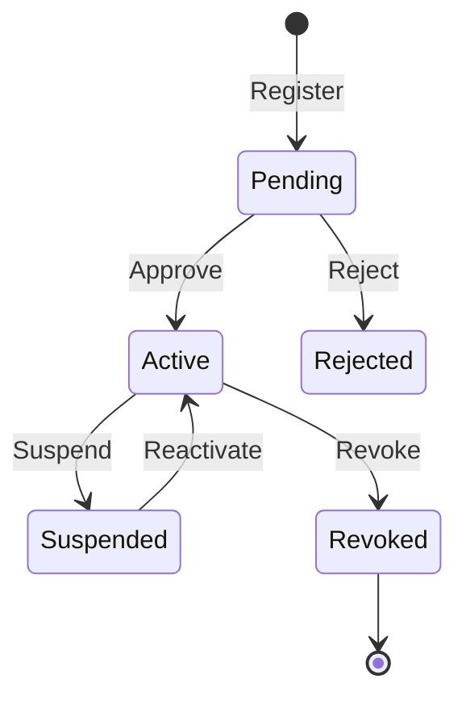

import Tabs from '@theme/Tabs';
import TabItem from '@theme/TabItem';

# UAPK Manifest

A **UAPK Manifest** is a JSON document that declares an agent's identity, requested capabilities, and operational constraints. It's the foundation for policy enforcement.

## Purpose

The manifest serves as:

1. **Identity Declaration**: Who is this agent?
2. **Capability Request**: What permissions does it need?
3. **Constraint Definition**: What limits should apply?
4. **Documentation**: Contact info and docs links

## Schema

```json
{
  "$schema": "https://uapk.dev/schemas/manifest.v1.json",
  "version": "1.0",
  "agent": {
    "id": "customer-support-bot",
    "name": "Customer Support Bot",
    "version": "1.0.0",
    "description": "Handles customer inquiries via email and CRM",
    "organization": "acme-corp",
    "team": "support"
  },
  "capabilities": {
    "requested": [
      "email:send",
      "email:read",
      "crm:read",
      "crm:update"
    ]
  },
  "constraints": {
    "max_actions_per_hour": 100,
    "max_actions_per_day": 500,
    "require_human_approval": [
      "crm:delete",
      "email:send-bulk"
    ],
    "allowed_hours": {
      "start": "08:00",
      "end": "20:00",
      "timezone": "America/New_York"
    }
  },
  "metadata": {
    "contact": "support-team@acme.com",
    "documentation": "https://docs.acme.com/agents/support-bot"
  }
}
```

## Fields Reference

### `agent` (required)

| Field | Type | Description |
|-------|------|-------------|
| `id` | string | Unique identifier for the agent (used in API calls) |
| `name` | string | Human-readable name |
| `version` | string | Semantic version of the agent |
| `description` | string | What the agent does |
| `organization` | string | Organization identifier |
| `team` | string | Team within the organization |

### `capabilities` (required)

| Field | Type | Description |
|-------|------|-------------|
| `requested` | array | List of capability strings the agent needs |

Capability format: `resource:action`, e.g., `email:send`, `crm:update`

### `constraints` (optional)

| Field | Type | Description |
|-------|------|-------------|
| `max_actions_per_hour` | integer | Rate limit per hour |
| `max_actions_per_day` | integer | Rate limit per day |
| `require_human_approval` | array | Actions that require HITL approval |
| `allowed_hours` | object | Time window restrictions |
| `allowed_hours.start` | string | Start time (HH:MM) |
| `allowed_hours.end` | string | End time (HH:MM) |
| `allowed_hours.timezone` | string | IANA timezone |

### `metadata` (optional)

| Field | Type | Description |
|-------|------|-------------|
| `contact` | string | Contact email for the agent owner |
| `documentation` | string | URL to agent documentation |
| `source` | string | URL to agent source code |

## Example Manifests

### Customer Support Agent

```json
{
  "$schema": "https://uapk.dev/schemas/manifest.v1.json",
  "version": "1.0",
  "agent": {
    "id": "customer-support-bot",
    "name": "Customer Support Bot",
    "version": "1.0.0",
    "description": "AI agent that handles customer support inquiries",
    "organization": "acme-corp",
    "team": "support"
  },
  "capabilities": {
    "requested": [
      "email:send",
      "email:read",
      "crm:read",
      "crm:update",
      "knowledge-base:search"
    ]
  },
  "constraints": {
    "max_actions_per_hour": 100,
    "max_actions_per_day": 500,
    "require_human_approval": [
      "crm:delete",
      "email:send-bulk"
    ],
    "allowed_hours": {
      "start": "08:00",
      "end": "20:00",
      "timezone": "America/New_York"
    }
  },
  "metadata": {
    "contact": "support-team@acme.com",
    "documentation": "https://docs.acme.com/agents/support-bot"
  }
}
```

### Deployment Agent

```json
{
  "$schema": "https://uapk.dev/schemas/manifest.v1.json",
  "version": "1.0",
  "agent": {
    "id": "deployment-bot",
    "name": "Deployment Bot",
    "version": "2.1.0",
    "description": "Manages code deployments and infrastructure",
    "organization": "acme-corp",
    "team": "engineering"
  },
  "capabilities": {
    "requested": [
      "github:read",
      "github:create-pr",
      "github:merge",
      "kubernetes:read",
      "kubernetes:deploy",
      "slack:send"
    ]
  },
  "constraints": {
    "max_actions_per_hour": 50,
    "require_human_approval": [
      "kubernetes:deploy",
      "github:merge"
    ]
  },
  "metadata": {
    "contact": "platform-team@acme.com",
    "source": "https://github.com/acme/deployment-bot"
  }
}
```

## Registering a Manifest

<Tabs>
<TabItem value="curl" label="curl">

```bash
curl -X POST http://localhost:8000/api/v1/orgs/$ORG_ID/manifests \
  -H "Authorization: Bearer $TOKEN" \
  -H "Content-Type: application/json" \
  -d @my-agent.json
```

</TabItem>
<TabItem value="python" label="Python">

```python
import httpx

manifest = {
    "version": "1.0",
    "agent": {
        "id": "my-agent",
        "name": "My Agent",
        "version": "1.0.0"
    },
    "capabilities": {
        "requested": ["email:send"]
    }
}

response = httpx.post(
    f"{BASE_URL}/api/v1/orgs/{org_id}/manifests",
    headers={"Authorization": f"Bearer {token}"},
    json=manifest
)
```

</TabItem>
</Tabs>

## Manifest Lifecycle



| Status | Description |
|--------|-------------|
| `pending` | Newly registered, awaiting approval |
| `active` | Approved and operational |
| `suspended` | Temporarily disabled |
| `revoked` | Permanently disabled |

## Best Practices

:::tip[Principle of Least Privilege]
Only request the capabilities your agent actually needs. This reduces blast radius if the agent is compromised.
:::

:::tip[Use Constraints]
Define rate limits and approval requirements to prevent runaway behavior.
:::

:::tip[Version Your Manifests]
Update the `agent.version` when capabilities change. This helps with audit trails.
:::

:::warning[Manifest Hashing]
The gateway computes a SHA-256 hash of each manifest. Any modification requires re-registration.
:::

## Related

- [Capability Tokens](capabilities.md) - Issuing tokens based on manifests
- [Policy Decisions](decisions.md) - How manifests affect policy evaluation
- [API: Manifests](../api/manifests.md) - Complete API reference
