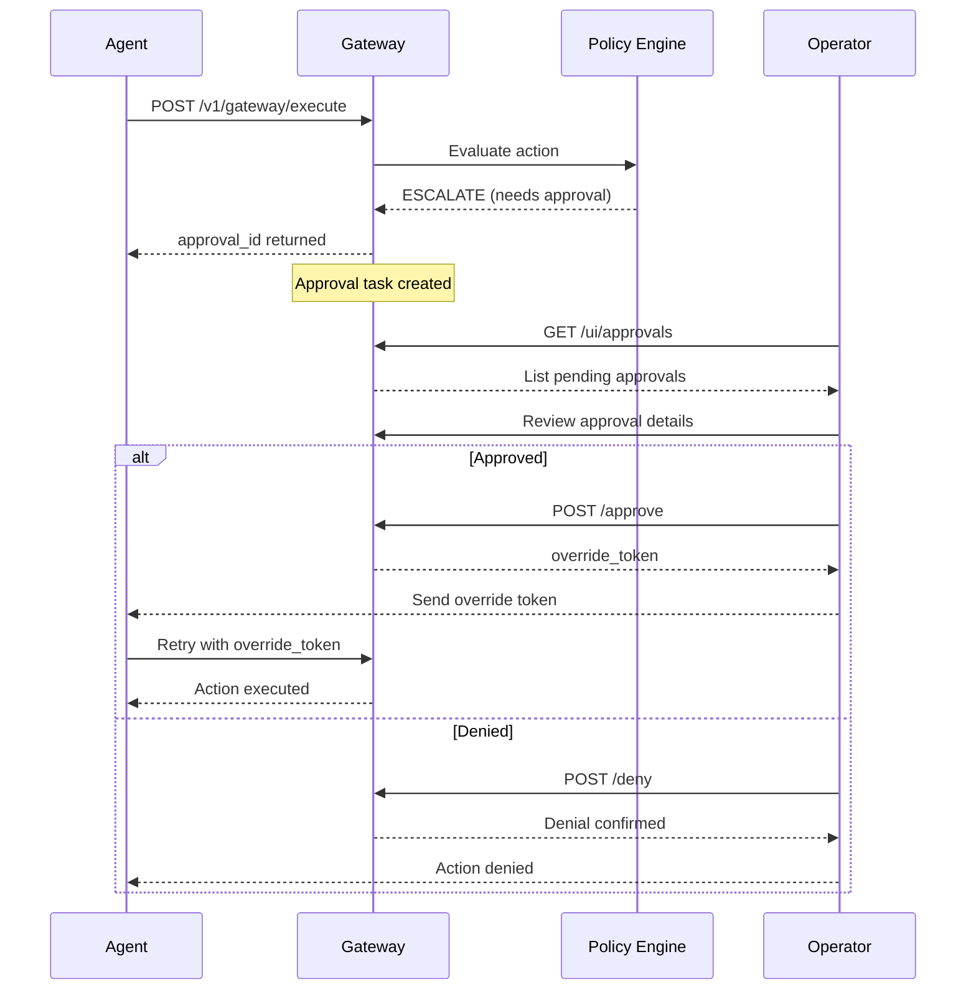

# Approval Workflow

The approval workflow enables human-in-the-loop oversight for sensitive agent actions. When the policy engine determines an action requires human approval, it creates an approval task that operators can review and act upon.

## Overview

The approval flow works as follows:



## When Actions Escalate

Actions are escalated to approval when:

| Reason Code | Description |
|-------------|-------------|
| `requires_human_approval` | Action type requires explicit approval |
| `amount_requires_approval` | Amount exceeds auto-approval threshold |
| `budget_threshold_reached` | Agent is approaching daily budget limit |

## Approval Task Lifecycle

1. **PENDING** - Task created, awaiting operator decision
2. **APPROVED** - Operator approved; override token generated
3. **DENIED** - Operator denied the action
4. **EXPIRED** - Task expired without decision (default: 24 hours)

## Managing Approvals

### Via Dashboard

Navigate to `/ui/approvals` to see all approval tasks. From there you can:

1. Filter by status (pending, approved, denied, expired)
2. View approval details
3. Approve or deny pending requests

### Via API

#### List Approvals

```bash
# List all approvals
curl /v1/approvals \
  -H "Authorization: Bearer $TOKEN"

# Filter by status
curl "/v1/approvals?status=pending" \
  -H "Authorization: Bearer $TOKEN"

# Filter by UAPK ID
curl "/v1/approvals?uapk_id=my-agent" \
  -H "Authorization: Bearer $TOKEN"
```

#### Get Pending Approvals

```bash
curl /v1/approvals/pending \
  -H "Authorization: Bearer $TOKEN"
```

#### Get Approval Details

```bash
curl /v1/approvals/appr-abc123 \
  -H "Authorization: Bearer $TOKEN"
```

Response:
```json
{
  "id": "uuid",
  "approval_id": "appr-abc123",
  "org_id": "uuid",
  "interaction_id": "int-xyz789",
  "uapk_id": "my-agent",
  "agent_id": "my-agent-instance",
  "action": {
    "type": "payment",
    "tool": "stripe_transfer",
    "params": {
      "amount": 5000,
      "currency": "USD",
      "recipient": "vendor-456"
    }
  },
  "counterparty": {
    "id": "vendor-456",
    "type": "merchant",
    "jurisdiction": "US"
  },
  "reason_codes": ["amount_requires_approval"],
  "status": "pending",
  "created_at": "2024-12-14T10:00:00Z",
  "expires_at": "2024-12-15T10:00:00Z"
}
```

#### Approve an Action

```bash
curl -X POST /v1/approvals/appr-abc123/approve \
  -H "Authorization: Bearer $TOKEN" \
  -H "Content-Type: application/json" \
  -d '{
    "notes": "Approved after verification",
    "override_token_expires_in_seconds": 300
  }'
```

Response:
```json
{
  "approval_id": "appr-abc123",
  "status": "approved",
  "decided_at": "2024-12-14T10:15:00Z",
  "decided_by": "user-uuid",
  "override_token": "eyJhbGciOiJFZERTQSIsInR5cCI6IkpXVCJ9...",
  "override_token_expires_at": "2024-12-14T10:20:00Z"
}
```

#### Deny an Action

```bash
curl -X POST /v1/approvals/appr-abc123/deny \
  -H "Authorization: Bearer $TOKEN" \
  -H "Content-Type: application/json" \
  -d '{
    "reason": "Amount too high",
    "notes": "Exceeded monthly vendor limit"
  }'
```

#### Get Approval Statistics

```bash
curl /v1/approvals/stats \
  -H "Authorization: Bearer $TOKEN"
```

```json
{
  "pending": 3,
  "approved": 45,
  "denied": 12,
  "expired": 5,
  "total": 65
}
```

## Override Tokens

When an action is approved, the gateway generates a short-lived **override token**. This token:

- Is bound to the specific action (by hash)
- Has a configurable expiry (default: 5 minutes, max: 60 minutes)
- Can only be used once
- Bypasses policy checks for the approved action

### Using Override Tokens

The agent retries the original request with the override token:

```bash
curl -X POST /v1/gateway/execute \
  -H "Authorization: Bearer $API_KEY" \
  -H "Content-Type: application/json" \
  -d '{
    "uapk_id": "my-agent",
    "agent_id": "my-agent-instance",
    "capability_token": "override-token-here",
    "action": {
      "type": "payment",
      "tool": "stripe_transfer",
      "params": {
        "amount": 5000,
        "currency": "USD",
        "recipient": "vendor-456"
      }
    }
  }'
```

The action in the retry **must match** the original action that was approved. If the parameters differ, the override token will be rejected.

## Configuration

Configure approval behavior in your environment:

```bash
# How long approval tasks remain valid (hours)
GATEWAY_APPROVAL_EXPIRY_HOURS=24

# Default override token expiry (seconds)
GATEWAY_OVERRIDE_TOKEN_EXPIRY_SECONDS=300
```

### Per-Action Escalation Rules

Configure in your UAPK manifest or organization policies:

```json
{
  "policy": {
    "amount_caps": {
      "max_amount": 10000,
      "escalate_above": 1000
    },
    "require_approval": ["high_risk_transfer"],
    "auto_approve": ["read_only"]
  },
  "constraints": {
    "max_actions_per_day": 100,
    "budget_escalate_at_percent": 90
  }
}
```

## Best Practices

### Response Time

- Set appropriate expiry times for your use case
- Implement notification systems for urgent approvals
- Consider auto-expiry for non-critical actions

### Audit Trail

All approval decisions are logged:
- Who approved/denied
- When the decision was made
- Notes provided
- Override token issued (if approved)

### Security

- Only authorized users can approve/deny actions
- Override tokens are cryptographically bound to actions
- Expired approvals cannot be approved
- Already-decided approvals cannot be modified

### Agent Behavior

Design agents to handle escalation gracefully:

```python
response = gateway.execute(action)

if response["decision"] == "escalate":
    approval_id = response["approval_id"]
    # Notify user that approval is required
    # Poll for approval or use webhooks
    # Retry with override token when approved
```

## Webhooks (Coming Soon)

Configure webhooks to be notified of approval events:

```json
{
  "webhooks": {
    "approval_created": "https://your-service/approvals/new",
    "approval_decided": "https://your-service/approvals/decided"
  }
}
```

## Next Steps

- [Capability Tokens](capability-tokens.md) - Learn about token-based permissions
- [Policies](policies.md) - Configure escalation policies
- [API Reference](../api/endpoints.md) - Full API documentation
