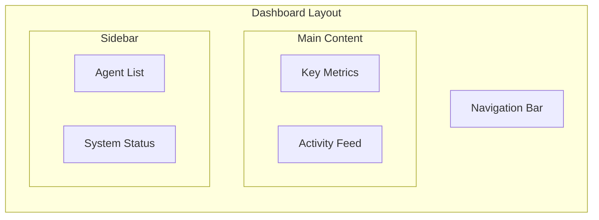

# Dashboard

The operator dashboard provides real-time visibility into agent activity and system health.

## Accessing the Dashboard

Navigate to:

```
http://localhost:8000/ui
```

Login with your operator credentials.

## Dashboard Overview



## Key Metrics

The dashboard displays real-time metrics:

| Metric | Description |
|--------|-------------|
| **Actions Today** | Total actions processed |
| **Approval Rate** | Percentage of allowed actions |
| **Pending Approvals** | Requests awaiting review |
| **Active Agents** | Agents with recent activity |

### Metric Cards

```
┌─────────────────┐  ┌─────────────────┐  ┌─────────────────┐  ┌─────────────────┐
│  Actions Today  │  │  Approval Rate  │  │    Pending      │  │  Active Agents  │
│     1,234       │  │      94.5%      │  │       3         │  │       5         │
│    ↑12%         │  │    ↑2.1%        │  │    ↓2           │  │    ━           │
└─────────────────┘  └─────────────────┘  └─────────────────┘  └─────────────────┘
```

## Activity Feed

Real-time feed of recent actions:

```
┌────────────────────────────────────────────────────────────────────────────┐
│ ACTIVITY FEED                                                    [Filter ▼]│
├────────────────────────────────────────────────────────────────────────────┤
│ ✓ 10:32:15  customer-support-bot  email:send       ALLOWED                 │
│ ✓ 10:31:42  customer-support-bot  crm:update       ALLOWED                 │
│ ⚠ 10:30:18  deployment-bot        k8s:deploy       ESCALATED  [Review →]   │
│ ✗ 10:29:55  customer-support-bot  crm:delete       DENIED     budget       │
│ ✓ 10:28:33  deployment-bot        github:read      ALLOWED                 │
└────────────────────────────────────────────────────────────────────────────┘
```

### Filtering Activity

Filter by:

- **Agent**: Select specific agents
- **Decision**: allowed, denied, escalated
- **Action Type**: email, crm, kubernetes, etc.
- **Time Range**: Last hour, today, custom

## Agent Status

Monitor individual agent health:

```
┌────────────────────────────────────────────────────────────────────────────┐
│ AGENTS                                                                      │
├────────────────────────────────────────────────────────────────────────────┤
│ ● customer-support-bot    Active    45/100 actions    Last: 2m ago         │
│ ● deployment-bot          Active    12/50 actions     Last: 5m ago         │
│ ○ backup-agent            Idle      0/100 actions     Last: 2h ago         │
│ ◐ analytics-bot           Suspended --                Suspended 1d ago     │
└────────────────────────────────────────────────────────────────────────────┘
```

### Status Indicators

| Icon | Status | Description |
|------|--------|-------------|
| ● | Active | Recent activity within last 15 minutes |
| ○ | Idle | No recent activity |
| ◐ | Suspended | Manifest is suspended |
| ✗ | Revoked | Manifest is revoked |

## System Health

Monitor gateway health:

```
┌────────────────────────────────────────────────────────────────────────────┐
│ SYSTEM HEALTH                                                               │
├────────────────────────────────────────────────────────────────────────────┤
│ Gateway API      ● Healthy    Response: 12ms                               │
│ Database         ● Healthy    Connections: 5/20                            │
│ Log Chain        ● Valid      Last verified: 6h ago                        │
│ Background Jobs  ● Running    Queue: 0 pending                             │
└────────────────────────────────────────────────────────────────────────────┘
```

## Quick Actions

From the dashboard, you can:

### Suspend an Agent

1. Click the agent in the sidebar
2. Click **Suspend**
3. Enter a reason
4. Confirm

### View Agent Details

1. Click the agent name
2. View manifest, capabilities, recent activity
3. Access action history

### Jump to Pending Approvals

Click the pending approvals count to view the approval queue.

## Notifications

Configure notifications for:

- New pending approvals
- Agent budget warnings (>80% usage)
- Chain verification failures
- Unusual activity patterns

### Notification Channels

| Channel | Setup |
|---------|-------|
| Email | Configure in Settings → Notifications |
| Slack | Add Slack webhook URL |
| Webhook | Custom HTTP endpoint |

## Keyboard Shortcuts

| Shortcut | Action |
|----------|--------|
| `a` | Go to Approvals |
| `l` | Go to Logs |
| `d` | Go to Dashboard |
| `?` | Show keyboard shortcuts |
| `/` | Focus search |

## Related

- [Approvals](approvals.md) - Managing approvals
- [Audit](audit.mdx) - Viewing logs
- [Incidents](incidents.md) - Responding to issues
