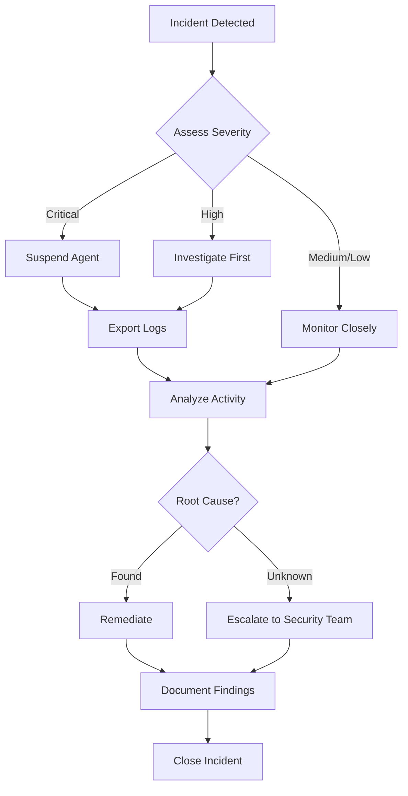

# Incident Response

This guide covers responding to security events and anomalies detected by UAPK Gateway.

## Incident Types

| Type | Severity | Description |
|------|----------|-------------|
| **Chain Break** | Critical | Log chain integrity compromised |
| **Signature Failure** | Critical | Invalid Ed25519 signature detected |
| **Unusual Activity** | High | Abnormal action patterns |
| **Budget Exhaustion** | Medium | Agent hitting rate limits |
| **Repeated Denials** | Medium | Multiple policy violations |
| **Expired Approvals** | Low | Pending approvals not addressed |

## Immediate Response

### 1. Chain Break Detected

A chain break indicates potential tampering.

**Symptoms:**
- Verification returns `CHAIN_BREAK` error
- Previous hash mismatch between records

**Response:**

```bash
# 1. Suspend all affected agents immediately
curl -X POST http://localhost:8000/api/v1/orgs/$ORG_ID/manifests/$MANIFEST_ID/suspend \
  -H "Authorization: Bearer $TOKEN" \
  -H "Content-Type: application/json" \
  -d '{"reason": "Chain integrity investigation"}'

# 2. Export logs before and after the break
curl -X POST http://localhost:8000/api/v1/orgs/$ORG_ID/logs/export/download \
  -H "Authorization: Bearer $TOKEN" \
  -H "Content-Type: application/json" \
  -d '{"uapk_id": "affected-agent"}' > investigation.json

# 3. Identify the break point
python verify_log_chain.py investigation.json --verbose
```

**Investigation:**
- Determine when the break occurred
- Check database access logs
- Review backup integrity
- Assess scope of impact

### 2. Signature Verification Failure

Invalid signature indicates tampering or key compromise.

**Response:**

```bash
# 1. Suspend agent
curl -X POST http://localhost:8000/api/v1/orgs/$ORG_ID/manifests/$MANIFEST_ID/suspend \
  -H "Authorization: Bearer $TOKEN" \
  -d '{"reason": "Signature verification failure"}'

# 2. Check signing key status
curl http://localhost:8000/api/v1/gateway/keys/status \
  -H "Authorization: Bearer $TOKEN"

# 3. If key compromise suspected, rotate keys
curl -X POST http://localhost:8000/api/v1/gateway/keys/rotate \
  -H "Authorization: Bearer $TOKEN"
```

### 3. Unusual Activity Pattern

Abnormal action patterns may indicate compromise.

**Symptoms:**
- Sudden spike in action volume
- Actions at unusual times
- Unusual action types
- New counterparties

**Response:**

```bash
# 1. Review recent activity
curl "http://localhost:8000/api/v1/orgs/$ORG_ID/logs?uapk_id=suspect-agent&limit=100" \
  -H "Authorization: Bearer $TOKEN"

# 2. Compare to baseline
curl "http://localhost:8000/api/v1/orgs/$ORG_ID/logs/stats?from=2024-12-01" \
  -H "Authorization: Bearer $TOKEN"

# 3. If confirmed, suspend
curl -X POST http://localhost:8000/api/v1/orgs/$ORG_ID/manifests/$MANIFEST_ID/suspend \
  -H "Authorization: Bearer $TOKEN" \
  -d '{"reason": "Unusual activity investigation"}'
```

## Suspension Procedures

### Suspend an Agent

```bash
curl -X POST http://localhost:8000/api/v1/orgs/$ORG_ID/manifests/$MANIFEST_ID/suspend \
  -H "Authorization: Bearer $TOKEN" \
  -H "Content-Type: application/json" \
  -d '{
    "reason": "Security investigation",
    "notes": "Ticket: SEC-12345"
  }'
```

### Revoke All Tokens

```bash
# List active tokens
curl http://localhost:8000/api/v1/orgs/$ORG_ID/capability-tokens?agent_id=suspect-agent \
  -H "Authorization: Bearer $TOKEN"

# Revoke each token
curl -X POST http://localhost:8000/api/v1/orgs/$ORG_ID/capability-tokens/$TOKEN_ID/revoke \
  -H "Authorization: Bearer $TOKEN" \
  -d '{"reason": "Security incident"}'
```

### Emergency Revoke

Permanently revoke a manifest:

```bash
curl -X POST http://localhost:8000/api/v1/orgs/$ORG_ID/manifests/$MANIFEST_ID/revoke \
  -H "Authorization: Bearer $TOKEN" \
  -H "Content-Type: application/json" \
  -d '{
    "reason": "Security incident - agent compromised",
    "notes": "Ticket: SEC-12345. Agent to be decommissioned."
  }'
```

## Investigation Workflow



## Log Analysis

### Identify Anomalies

```bash
# High-volume analysis
curl "http://localhost:8000/api/v1/orgs/$ORG_ID/logs/stats" \
  -H "Authorization: Bearer $TOKEN" | jq '.by_agent | sort_by(.records) | reverse'

# Denied action patterns
curl "http://localhost:8000/api/v1/orgs/$ORG_ID/logs?decision=denied&limit=100" \
  -H "Authorization: Bearer $TOKEN"

# Time-based analysis
curl "http://localhost:8000/api/v1/orgs/$ORG_ID/logs?from=2024-12-14T02:00:00Z&to=2024-12-14T04:00:00Z" \
  -H "Authorization: Bearer $TOKEN"
```

### Export for Forensics

```bash
# Full export with all details
curl -X POST http://localhost:8000/api/v1/orgs/$ORG_ID/logs/export/download \
  -H "Authorization: Bearer $TOKEN" \
  -H "Content-Type: application/json" \
  -d '{
    "uapk_id": "suspect-agent",
    "from": "2024-12-01T00:00:00Z",
    "include_manifest": true
  }' > forensics-export.json
```

## Recovery Procedures

### Reactivate Suspended Agent

After investigation clears the agent:

```bash
curl -X POST http://localhost:8000/api/v1/orgs/$ORG_ID/manifests/$MANIFEST_ID/reactivate \
  -H "Authorization: Bearer $TOKEN" \
  -H "Content-Type: application/json" \
  -d '{
    "notes": "Investigation complete - SEC-12345. No issues found."
  }'
```

### Issue New Tokens

```bash
curl -X POST http://localhost:8000/api/v1/orgs/$ORG_ID/capability-tokens \
  -H "Authorization: Bearer $TOKEN" \
  -H "Content-Type: application/json" \
  -d '{
    "issuer_id": "issuer-abc123",
    "agent_id": "cleared-agent",
    "manifest_id": "'$MANIFEST_ID'",
    "capabilities": ["email:send", "crm:read"],
    "expires_in_hours": 24
  }'
```

## Incident Documentation

Document every incident with:

1. **Detection**: How was it detected?
2. **Timeline**: When did it occur?
3. **Scope**: What was affected?
4. **Response**: What actions were taken?
5. **Root Cause**: What caused it?
6. **Remediation**: How was it fixed?
7. **Prevention**: How to prevent recurrence?

### Incident Template

```markdown
# Incident Report: [ID]

## Summary
Brief description of the incident.

## Timeline
- YYYY-MM-DD HH:MM - Incident detected
- YYYY-MM-DD HH:MM - Agent suspended
- YYYY-MM-DD HH:MM - Investigation started
- YYYY-MM-DD HH:MM - Root cause identified
- YYYY-MM-DD HH:MM - Remediation complete
- YYYY-MM-DD HH:MM - Agent reactivated

## Impact
- Agents affected: X
- Actions during incident: Y
- Data exposure: None/Limited/Significant

## Root Cause
Description of what caused the incident.

## Remediation
Steps taken to resolve the incident.

## Prevention
Measures to prevent recurrence.

## Attachments
- Log exports
- Verification reports
- Screenshots
```

## Contact Escalation

| Severity | Response Time | Escalation |
|----------|---------------|------------|
| Critical | Immediate | Security Team Lead |
| High | < 1 hour | On-call Operator |
| Medium | < 4 hours | Team Queue |
| Low | Next business day | Normal workflow |

## Related

- [Security](../security) - Security practices
- [Audit](audit.mdx) - Log analysis
- [Key Management](../security/key-management.md) - Key security
