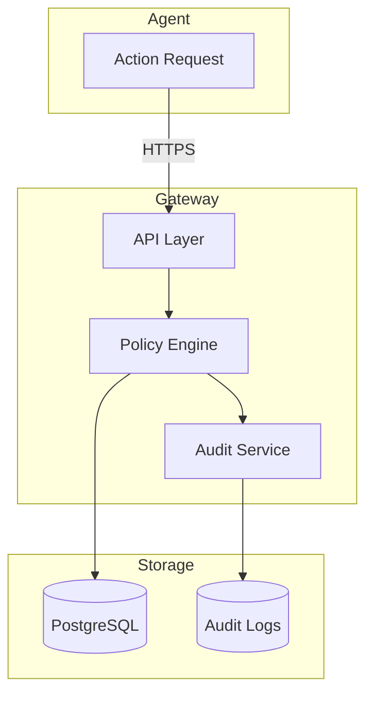

# Data Handling

This document describes how UAPK Gateway handles data at rest and in transit.

## Data Categories

| Category | Examples | Sensitivity |
|----------|----------|-------------|
| **Credentials** | API keys, tokens, passwords | Critical |
| **Audit Logs** | Action records, hashes, signatures | High |
| **Manifests** | Agent capabilities, constraints | Medium |
| **Configuration** | Org settings, policies | Medium |
| **Metadata** | Timestamps, IDs | Low |

## Data Flow



## Encryption

### In Transit

All data is encrypted in transit using TLS 1.2+.

| Endpoint | Protocol | Cipher Suites |
|----------|----------|---------------|
| API | HTTPS/TLS 1.2+ | ECDHE, AES-GCM |
| Database | TLS | ECDHE, AES-GCM |
| Dashboard | HTTPS/TLS 1.2+ | ECDHE, AES-GCM |

**Configuration**:

```nginx
# Recommended Caddy/Nginx TLS settings
ssl_protocols TLSv1.2 TLSv1.3;
ssl_ciphers ECDHE-ECDSA-AES128-GCM-SHA256:ECDHE-RSA-AES128-GCM-SHA256;
ssl_prefer_server_ciphers on;
```

### At Rest

| Data | Encryption | Notes |
|------|------------|-------|
| Database | PostgreSQL encryption | Enable at DB level |
| Audit Logs | File system encryption | Use encrypted volumes |
| Signing Keys | HSM or encrypted storage | See Key Management |
| Backups | AES-256 | Encrypt before storage |

## Sensitive Data Handling

### Passwords

- Hashed using bcrypt with cost factor 12
- Never logged or exposed in API responses
- Reset tokens expire after 1 hour

### API Keys

- Generated with cryptographically secure random bytes
- Stored as bcrypt hash (only prefix visible)
- Full key shown only once at creation

### Capability Tokens

- Ed25519 signed JWTs
- Short-lived (default 24 hours)
- Never stored server-side (stateless verification)

### Audit Logs

| Field | Handling |
|-------|----------|
| Request params | Stored as-is (may contain sensitive data) |
| Result data | Stored as-is |
| Hashes | SHA-256 of canonical JSON |
| Signatures | Ed25519, Base64 encoded |

:::warning[Request Parameter Sensitivity]
Action parameters are logged for audit purposes. Avoid including sensitive data (passwords, PII) in action parameters.
:::

## Data Retention

### Default Retention

| Data Type | Retention | Notes |
|-----------|-----------|-------|
| Audit Logs | Indefinite | Configure per compliance needs |
| Manifests | Until revoked | Historical versions preserved |
| API Keys | Until revoked | Revoked keys kept for audit |
| Sessions | 24 hours | Auto-expired |

### Configuring Retention

```bash
# Environment variable
GATEWAY_LOG_RETENTION_DAYS=365

# Or in settings
curl -X PATCH http://localhost:8000/api/v1/orgs/$ORG_ID \
  -H "Authorization: Bearer $TOKEN" \
  -d '{"settings": {"log_retention_days": 365}}'
```

### Data Deletion

:::warning[Audit Integrity]
Deleting audit logs breaks chain verification. Export and verify before deletion.
:::

```bash
# Archive old logs before deletion
curl -X POST http://localhost:8000/api/v1/orgs/$ORG_ID/logs/export/download \
  -H "Authorization: Bearer $TOKEN" \
  -d '{"to": "2023-12-31T23:59:59Z"}' > archive-2023.json

# Verify archive
python verify_log_chain.py archive-2023.json
```

## Database Security

### PostgreSQL Configuration

```ini
# postgresql.conf
ssl = on
ssl_cert_file = '/path/to/server.crt'
ssl_key_file = '/path/to/server.key'

# pg_hba.conf - require SSL
hostssl all all 0.0.0.0/0 scram-sha-256
```

### Access Control

- Dedicated database user with minimal permissions
- Network isolation (private subnet)
- No direct external access

### Backup Encryption

```bash
# Encrypted backup
pg_dump $DATABASE_URL | gpg --symmetric --cipher-algo AES256 > backup.sql.gpg

# Restore
gpg --decrypt backup.sql.gpg | psql $DATABASE_URL
```

## Log Sanitization

### What's Logged

| Field | Logged | Notes |
|-------|--------|-------|
| Action type/tool | Yes | Always logged |
| Request parameters | Yes | Includes action params |
| Result data | Yes | Includes execution result |
| Timestamps | Yes | UTC ISO 8601 |
| Agent ID | Yes | For attribution |
| Hashes/signatures | Yes | For verification |

### What's Not Logged

| Field | Reason |
|-------|--------|
| Full API keys | Security - only prefix logged |
| Passwords | Security - never logged |
| Full capability tokens | Security - only token ID logged |

### Redaction

For compliance, you may need to redact sensitive fields:

```python
# Example: Redact email addresses in exports
def redact_pii(record):
    if 'params' in record and 'to' in record['params']:
        record['params']['to'] = 'REDACTED'
    return record
```

## Compliance

### GDPR

| Requirement | Implementation |
|-------------|----------------|
| Right to access | Export logs filtered by subject |
| Right to erasure | Delete after retention period |
| Data minimization | Only log necessary fields |
| Consent | Manifest registration = consent |

### SOC 2

| Control | Implementation |
|---------|----------------|
| Access control | RBAC, API keys, tokens |
| Encryption | TLS in transit, at rest encryption |
| Audit logging | Tamper-evident hash chain |
| Availability | High availability deployment |

## Best Practices

:::tip[Minimize Sensitive Data]
Don't include passwords or secrets in action parameters.
:::

:::tip[Encrypt Backups]
Always encrypt database and log backups.
:::

:::tip[Network Isolation]
Run database on private network, no direct access.
:::

:::tip[Regular Audits]
Review what data is being logged regularly.
:::

## Related

- [Key Management](key-management.md) - Signing key security
- [Threat Model](threat-model.md) - Security threats
- [Deployment](../deployment) - Secure deployment
