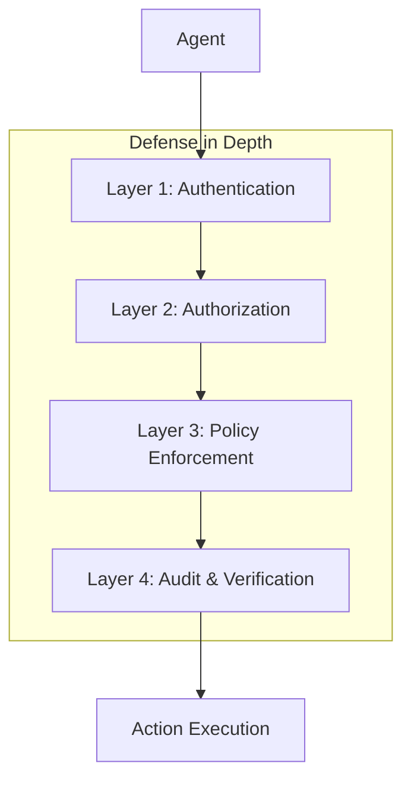

# Security

UAPK Gateway is designed with security as a core principle, providing defense-in-depth for AI agent operations.

## Security Model

## Security Principles

### 1. Zero Trust

- Every request is authenticated and authorized
- No implicit trust based on network location
- Continuous validation of credentials and capabilities

### 2. Least Privilege

- Agents only get the capabilities they declare
- Capability tokens can further restrict permissions
- Time-limited access by default

### 3. Defense in Depth

- Multiple layers of security controls
- No single point of failure
- Independent verification at each layer

### 4. Tamper Evidence

- Cryptographically signed audit logs
- Hash-chained records
- Offline verification capability

## Security Topics

- **Threat Model** - Understand the threats UAPK Gateway protects against - [Threat Model](threat-model.md)

- **Data Handling** - How data is stored, transmitted, and protected - [Data Handling](data-handling.md)

- **Key Management** - Managing Ed25519 signing keys securely - [Key Management](key-management.md)

## Security Features

| Feature | Description |
|---------|-------------|
| **Ed25519 Signatures** | Cryptographic signing of all audit records |
| **Hash Chaining** | Tamper-evident log chain |
| **JWT Capability Tokens** | Fine-grained, time-limited permissions |
| **Policy Enforcement** | Configurable allow/deny/escalate rules |
| **Human-in-the-Loop** | Approval workflow for sensitive actions |
| **Audit Trail** | Complete history of all decisions |

## Quick Security Checklist

- [ ] Use HTTPS in production
- [ ] Rotate API keys regularly
- [ ] Set short expiry for capability tokens
- [ ] Enable approval for sensitive actions
- [ ] Verify log chain integrity daily
- [ ] Backup signing keys securely
- [ ] Monitor for unusual activity
- [ ] Review denied actions for patterns

## Reporting Security Issues

If you discover a security vulnerability:

1. **Do not** open a public GitHub issue
2. Email security@uapk.info with details
3. Include steps to reproduce if possible
4. We'll respond within 48 hours

## Related

- [Threat Model](threat-model.md) - Detailed threat analysis
- [Data Handling](data-handling.md) - Data protection
- [Key Management](key-management.md) - Key security
