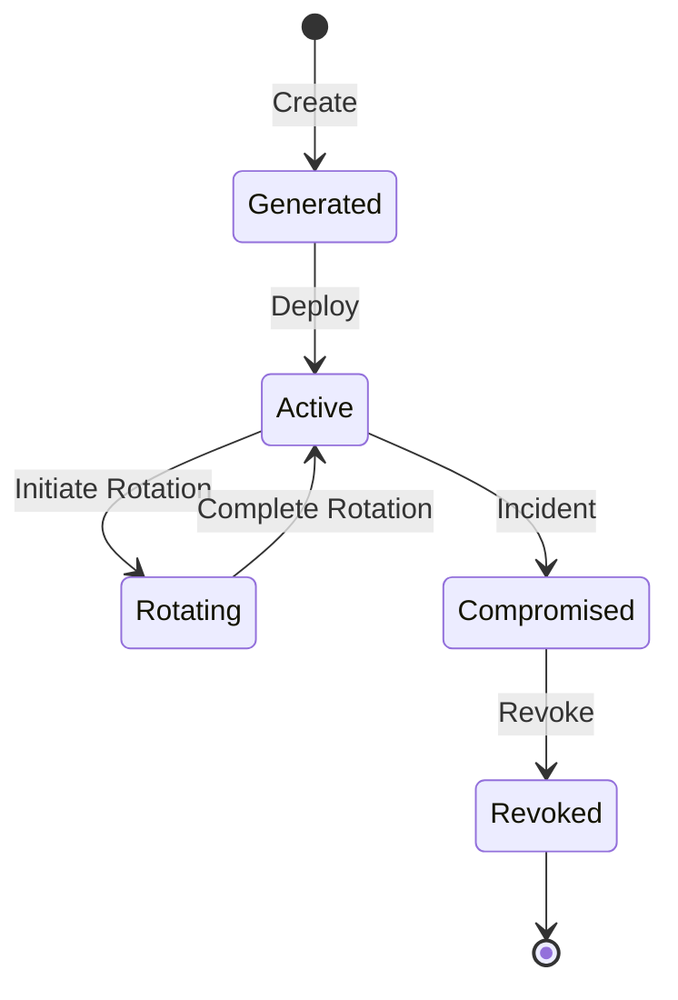
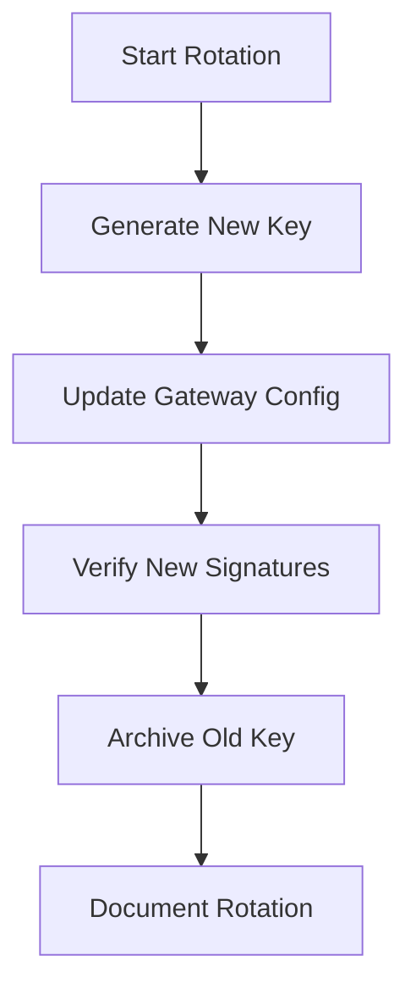

# Key Management

The Ed25519 signing key is critical to the security of UAPK Gateway. This guide covers secure key generation, storage, rotation, and recovery.

## Key Overview

| Key Type | Purpose | Algorithm |
|----------|---------|-----------|
| **Gateway Signing Key** | Sign audit records | Ed25519 |
| **Capability Issuer Keys** | Sign capability tokens | Ed25519 |

## Key Lifecycle



## Gateway Signing Key

### Generation

Generate a secure Ed25519 key pair:

```bash
# Generate key pair
python -c "
from cryptography.hazmat.primitives.asymmetric.ed25519 import Ed25519PrivateKey
from cryptography.hazmat.primitives import serialization

private_key = Ed25519PrivateKey.generate()
public_key = private_key.public_key()

# Save private key (keep secure!)
private_pem = private_key.private_bytes(
    encoding=serialization.Encoding.PEM,
    format=serialization.PrivateFormat.PKCS8,
    encryption_algorithm=serialization.NoEncryption()
)
with open('gateway_private.pem', 'wb') as f:
    f.write(private_pem)

# Save public key (can be distributed)
public_pem = public_key.public_bytes(
    encoding=serialization.Encoding.PEM,
    format=serialization.PublicFormat.SubjectPublicKeyInfo
)
with open('gateway_public.pem', 'wb') as f:
    f.write(public_pem)

print('Keys generated successfully')
"

# Set permissions
chmod 600 gateway_private.pem
chmod 644 gateway_public.pem
```

### Storage Options

#### Option 1: Environment Variable (Development)

```bash
# Not recommended for production
export GATEWAY_SIGNING_KEY=$(cat gateway_private.pem | base64)
```

#### Option 2: File-based (Simple Production)

```bash
# Store in protected directory
mkdir -p /etc/uapk-gateway/keys
cp gateway_private.pem /etc/uapk-gateway/keys/
chmod 600 /etc/uapk-gateway/keys/gateway_private.pem
chown uapk:uapk /etc/uapk-gateway/keys/gateway_private.pem

# Configure gateway
export GATEWAY_SIGNING_KEY_FILE=/etc/uapk-gateway/keys/gateway_private.pem
```

#### Option 3: Secrets Manager (Recommended)

```bash
# AWS Secrets Manager
aws secretsmanager create-secret \
  --name uapk-gateway/signing-key \
  --secret-string "$(cat gateway_private.pem)"

# Configure gateway
export GATEWAY_SIGNING_KEY_SECRET=aws:secretsmanager:uapk-gateway/signing-key
```

#### Option 4: HashiCorp Vault

```bash
# Store in Vault
vault kv put secret/uapk-gateway/signing-key \
  private_key=@gateway_private.pem

# Configure gateway
export GATEWAY_SIGNING_KEY_SECRET=vault:secret/data/uapk-gateway/signing-key#private_key
```

## Key Rotation

### When to Rotate

| Trigger | Action |
|---------|--------|
| Scheduled (annual) | Planned rotation |
| Key exposure suspected | Emergency rotation |
| Personnel change | Consider rotation |
| Security incident | Emergency rotation |

### Rotation Process



### Step-by-Step Rotation

```bash
# 1. Generate new key
python -c "
from cryptography.hazmat.primitives.asymmetric.ed25519 import Ed25519PrivateKey
from cryptography.hazmat.primitives import serialization

private_key = Ed25519PrivateKey.generate()
private_pem = private_key.private_bytes(
    encoding=serialization.Encoding.PEM,
    format=serialization.PrivateFormat.PKCS8,
    encryption_algorithm=serialization.NoEncryption()
)
with open('gateway_private_new.pem', 'wb') as f:
    f.write(private_pem)
"

# 2. Verify current chain before rotation
curl http://localhost:8000/api/v1/orgs/$ORG_ID/logs/verify/all \
  -H "Authorization: Bearer $TOKEN"

# 3. Export current logs
curl -X POST http://localhost:8000/api/v1/orgs/$ORG_ID/logs/export/download \
  -H "Authorization: Bearer $TOKEN" \
  -d '{}' > pre-rotation-export.json

# 4. Update gateway configuration (during maintenance window)
# Replace GATEWAY_SIGNING_KEY_FILE with new key

# 5. Restart gateway
systemctl restart uapk-gateway

# 6. Verify new key is active
curl http://localhost:8000/api/v1/gateway/keys/status \
  -H "Authorization: Bearer $TOKEN"

# 7. Archive old key securely
mv gateway_private.pem gateway_private_$(date +%Y%m%d).pem.archived
```

### Maintaining Verification

After rotation, old records can still be verified using the archived public key:

```bash
# Include old public keys in verification
python verify_log_chain.py pre-rotation-export.json \
  --public-keys gateway_public_old.pem,gateway_public_new.pem
```

## Capability Issuer Keys

### Creating an Issuer

```bash
curl -X POST http://localhost:8000/api/v1/orgs/$ORG_ID/capability-issuers \
  -H "Authorization: Bearer $TOKEN" \
  -H "Content-Type: application/json" \
  -d '{
    "name": "production-issuer",
    "description": "Primary issuer for production tokens"
  }'
```

Response includes the public key:

```json
{
  "issuer_id": "issuer-abc123",
  "name": "production-issuer",
  "public_key": "MCowBQYDK2VwAyEA...",
  "created_at": "2024-12-14T10:00:00Z"
}
```

### Rotating Issuer Keys

```bash
# Create new issuer
curl -X POST http://localhost:8000/api/v1/orgs/$ORG_ID/capability-issuers \
  -H "Authorization: Bearer $TOKEN" \
  -d '{"name": "production-issuer-v2"}'

# Update agents to use new issuer
# ...

# Revoke old issuer (after all tokens expire)
curl -X POST http://localhost:8000/api/v1/orgs/$ORG_ID/capability-issuers/issuer-abc123/revoke \
  -H "Authorization: Bearer $TOKEN"
```

## Key Backup

### Backup Strategy

| Backup Type | Frequency | Retention |
|-------------|-----------|-----------|
| Encrypted backup | Weekly | 1 year |
| Offline copy | Monthly | Indefinite |
| Geographic redundancy | Quarterly | Indefinite |

### Backup Procedure

```bash
# Encrypt backup
gpg --symmetric --cipher-algo AES256 \
  -o gateway_private.pem.gpg gateway_private.pem

# Store in multiple locations
aws s3 cp gateway_private.pem.gpg s3://backup-bucket/keys/
cp gateway_private.pem.gpg /mnt/backup-drive/keys/

# Document passphrase securely (separate from backup)
```

## Key Recovery

### Recovery Procedure

```bash
# 1. Retrieve encrypted backup
aws s3 cp s3://backup-bucket/keys/gateway_private.pem.gpg .

# 2. Decrypt
gpg --decrypt gateway_private.pem.gpg > gateway_private.pem

# 3. Verify key matches public key
python -c "
from cryptography.hazmat.primitives import serialization

with open('gateway_private.pem', 'rb') as f:
    private_key = serialization.load_pem_private_key(f.read(), password=None)

public_bytes = private_key.public_key().public_bytes(
    encoding=serialization.Encoding.PEM,
    format=serialization.PublicFormat.SubjectPublicKeyInfo
)
print(public_bytes.decode())
"

# 4. Compare with known public key
# 5. Restore to gateway
```

## Compromise Response

If you suspect key compromise:

```bash
# 1. Immediate: Rotate to new key
# See rotation procedure above

# 2. Revoke all capability tokens
curl -X POST http://localhost:8000/api/v1/orgs/$ORG_ID/capability-tokens/revoke-all \
  -H "Authorization: Bearer $TOKEN" \
  -d '{"reason": "Key compromise incident"}'

# 3. Export and verify logs signed with old key
curl -X POST http://localhost:8000/api/v1/orgs/$ORG_ID/logs/export/download \
  -H "Authorization: Bearer $TOKEN" \
  -d '{}' > incident-export.json

python verify_log_chain.py incident-export.json

# 4. Document incident
# 5. Notify affected parties if required
```

## Security Controls

### Access Control

| Control | Implementation |
|---------|----------------|
| File permissions | 600 (owner read/write only) |
| User isolation | Run gateway as dedicated user |
| Network isolation | Keys never transmitted over network |
| Audit logging | Log all key operations |

### Monitoring

| Event | Action |
|-------|--------|
| Key file access | Log and alert |
| Signature failures | Alert immediately |
| Key rotation | Log and notify |

## Best Practices

:::tip[Use Secrets Management]
Use a secrets manager (Vault, AWS Secrets Manager) in production.
:::

:::tip[Regular Rotation]
Rotate signing keys at least annually.
:::

:::tip[Backup Verification]
Test backup recovery quarterly.
:::

:::warning[Never Share Private Keys]
Private keys should never leave the production environment.
:::

:::warning[Separate Environments]
Use different keys for dev, staging, and production.
:::

## Related

- [Data Handling](data-handling.md) - Data security
- [Threat Model](threat-model.md) - Security threats
- [Incident Response](../operator/incidents.md) - Responding to compromise
